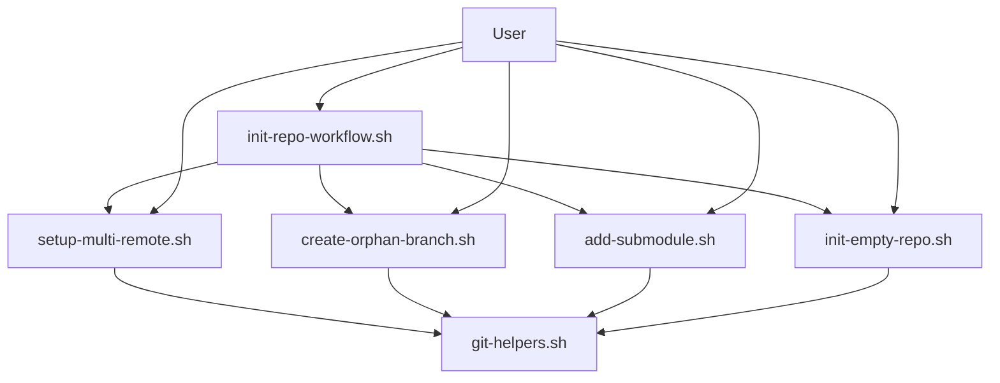
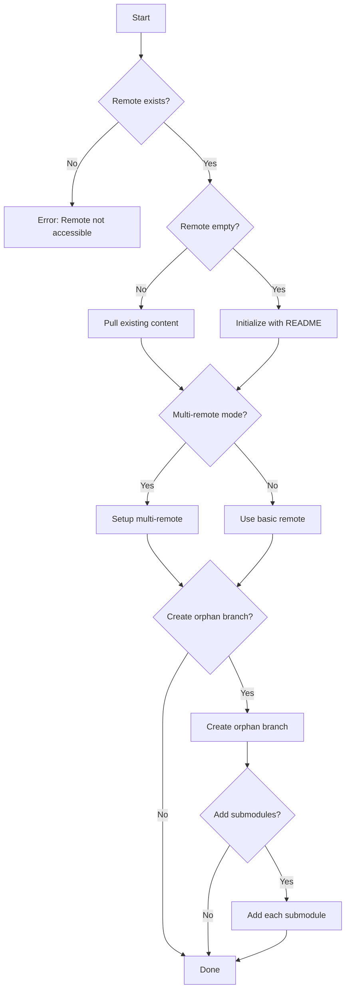

# Design Document: Repository Initialization Workflow

## Overview

This design document describes a comprehensive repository initialization workflow system that enables developers to set up Git repositories with advanced remote configurations, orphan branches, and submodule management. The system consists of modular shell scripts that can be used independently or orchestrated together through a unified workflow script.

The design builds upon existing scripts in the codebase (`init-empty-repo.sh`, `clone-with-upstream.sh`, `add-submodule.sh`) and introduces new components for multi-remote management and orphan branch operations.

## Design Decisions

### Recursive Repository Configuration

**Question**: How to handle a repository that is both a root repo (with its own submodules) AND a submodule of another repo?

**Answer**: Use **separated configuration** with two distinct prefixes:

| Configuration Type | Prefix | Location | Purpose |
|-------------------|--------|----------|---------|
| Root repo remotes | `kog-root-remote-*` | Root repo's `.gitmodules` | Configure root repo's own remotes |
| Submodule remotes | `kog-remote-*` | Super repo's `.gitmodules` | Configure submodule's remotes |

**Rationale**:
1. **Clear separation**: Root repo and submodule configurations are completely independent
2. **Single source of truth**: Each repo's configuration is stored in its own `.gitmodules`
3. **Git compatibility**: Both use standard `.gitmodules`, Git preserves unknown fields
4. **No filesystem dependency**: No need for additional config files or directory traversal
5. **Predictable behavior**: Configuration location is always `.gitmodules` in the relevant repo
6. **No ambiguity**: When working in a repo, you only configure its own remotes (kog-root-remote-*), not how it's configured as a submodule elsewhere

**Example Scenario**:

Imagine `myproject` is both:
- A standalone repo with its own submodules
- A submodule of `superproject`

**In myproject's `.gitmodules`** (configures myproject's own remotes):
```ini
[kog-root-remote "origin"]
    kog-url-ssh = git@github.com:myuser/myproject.git
    kog-url-https = https://github.com/myuser/myproject.git

[kog-root-remote "upstream"]
    kog-url-ssh = git@github.com:original/myproject.git
    kog-url-https = https://github.com/original/myproject.git

# Configuration
[kog-root-config]
    push-remote = origin
    protocol-priority = auto
```

**In superproject's `.gitmodules`** (configures myproject as a submodule):
```ini
[submodule "myproject"]
    path = projects/myproject
    url = https://github.com/myuser/myproject.git

    kog-remote-origin-ssh = git@github.com:myuser/myproject.git
    kog-remote-origin-https = https://github.com/myuser/myproject.git

    kog-remote-upstream-ssh = git@github.com:original/myproject.git
    kog-remote-upstream-https = https://github.com/original/myproject.git

    kog-push-remote = origin
    kog-protocol-priority = auto
```

**Key Insight**: When you're working inside `myproject`, you use `kog-submodule` commands WITHOUT `--path` to manage your own remotes. The super repo's configuration is irrelevant to your local work. The super repo's configuration only matters when someone clones `superproject` and runs `kog-submodule sync` from the super repo level.

**Commands**:
- `kog-submodule add` with `--path`: Configures submodule remotes (uses `kog-remote-*` in super repo's `.gitmodules`)
- `kog-submodule add` without `--path`: Configures root repo remotes (uses `kog-root-remote-*` in current repo's `.gitmodules`)
- `kog-submodule sync` with `--path`: Syncs submodule remotes from super repo's `.gitmodules`
- `kog-submodule sync` without `--path`: Syncs root repo remotes from current repo's `.gitmodules`

**Why No Filesystem Traversal?**

The user asked: "需要透過檔案系統輔助cd ..門上層查才有可能知道" (Do we need filesystem traversal to cd .. to the parent to know?)

**Answer**: No filesystem traversal is needed because:
1. When you're in `myproject` and run `kog-submodule` commands, you're managing `myproject`'s own remotes
2. You read from `myproject/.gitmodules` (kog-root-remote-* fields)
3. You write to `myproject/.git/config`
4. The fact that `myproject` might also be a submodule of `superproject` is irrelevant to this operation
5. The super repo's configuration is only used when someone works from the super repo level

**Source of Truth**:

The user noted: "理論上要以super為主，因為他是發動方" (Theoretically, the super repo should be the source of truth since it's the initiator)

**Answer**: Both are sources of truth, but for different contexts:
- **Super repo's `.gitmodules`**: Source of truth when working from super repo level (e.g., `kog-submodule sync projects/myproject`)
- **Root repo's `.gitmodules`**: Source of truth when working inside the repo itself (e.g., cd into myproject, then `kog-submodule sync`)

This separation ensures that:
- Developers working on `myproject` standalone can manage their own remotes
- Developers working on `superproject` can manage how `myproject` is configured as a submodule
- No conflicts or ambiguity between the two configurations

## Architecture

### Component Diagram



### Component Responsibilities

1. **init-repo-workflow.sh** (New): Orchestrates the complete initialization workflow
2. **setup-multi-remote.sh** (New): Manages multi-remote configurations with SSH/HTTP fallback
3. **create-orphan-branch.sh** (New): Creates and initializes orphan branches
4. **add-submodule.sh** (Existing): Adds Git submodules
5. **init-empty-repo.sh** (Existing): Initializes empty remote repositories
6. **git-helpers.sh** (Existing): Provides shared utility functions

## Components and Interfaces

### 1. setup-multi-remote.sh

**Purpose**: Configure multiple Git remotes with SSH/HTTP fallback capability.

**Interface**:
```bash
setup-multi-remote.sh --origin-ssh <url> --origin-http <url> [options]

Required Options:
  --origin-ssh <url>      SSH URL for origin remote
  --origin-http <url>     HTTP URL for origin remote

Optional Options:
  --upstream-ssh <url>    SSH URL for upstream remote
  --upstream-http <url>   HTTP URL for upstream remote
  --dir <path>            Repository directory (default: current directory)
  --validate              Validate that SSH and HTTP URLs point to same repository
  --dry-run               Show what would be done
  -h, --help              Show help
```

**Behavior**:
- Basic mode (origin only): Creates `origin` remote pointing to SSH URL
- Advanced mode (with upstream): Creates `origin-ssh`, `origin-http`, `upstream-ssh`, `upstream-http` remotes
- Validates URL pairs point to the same repository (optional)
- Provides helper function `push_with_fallback` for use in other scripts

**Remote Configuration Strategy**:

Basic Mode (single URL or no upstream):
```
origin -> SSH URL (or HTTP if only HTTP provided)
```

Advanced Mode (both SSH and HTTP URLs):
```
origin-ssh -> SSH URL for origin
origin-http -> HTTP URL for origin
upstream-ssh -> SSH URL for upstream (if provided)
upstream-http -> HTTP URL for upstream (if provided)
```

**Push Strategy**:
```bash
push_with_fallback() {
  local branch="$1"

  # Try SSH first
  if git push origin-ssh "$branch" 2>/dev/null; then
    return 0
  fi

  # Fallback to HTTP
  if git push origin-http "$branch" 2>/dev/null; then
    return 0
  fi

  # Both failed
  return 1
}
```

### 2. create-orphan-branch.sh

**Purpose**: Create and initialize orphan branches with proper safety checks.

**Interface**:
```bash
create-orphan-branch.sh --branch <name> [options]

Required Options:
  --branch <name>         Branch name

Optional Options:
  --file <name>           Initial file name (default: README.md)
  --content <text>        File content (default: "# {branch}")
  --message <text>        Commit message (default: "Initial commit")
  --push                  Push to remote after creation
  --return                Return to original branch after creation
  --force-overwrite-branch  Overwrite existing branch (DANGEROUS)
  --dir <path>            Repository directory (default: current directory)
  --dry-run               Show what would be done
  -h, --help              Show help
```

**Behavior**:
1. Validate branch name doesn't exist (local and remote)
2. Stash current changes if any
3. Create orphan branch using `git checkout --orphan`
4. Remove all files from index
5. Create initial file with content
6. Commit initial content
7. Optionally push to remote
8. Optionally return to original branch and restore stash

**Safety Features**:
- Pre-check for existing branch (local and remote)
- Auto-stash uncommitted changes
- Verbose flag name for destructive operations
- 3-second warning before overwriting existing branch

### 3. init-repo-workflow.sh

**Purpose**: Orchestrate the complete repository initialization workflow.

**Interface**:
```bash
init-repo-workflow.sh --repo-url <url> [options]

Required Options:
  --repo-url <url>        Repository URL (SSH or HTTP)

Optional Options:
  --repo-http-url <url>   HTTP URL (enables multi-remote mode)
  --upstream-ssh <url>    Upstream SSH URL
  --upstream-http <url>   Upstream HTTP URL
  --repo-dir <path>       Local repository directory
  --orphan-branch <name>  Orphan branch name (default: dev/gitmaster)
  --submodule <url:path>  Submodule to add (can be repeated)
  --skip-main-init        Skip main branch initialization
  --skip-orphan           Skip orphan branch creation
  --skip-submodules       Skip submodule addition
  --dry-run               Show what would be done
  -h, --help              Show help
```

**Workflow Steps**:



**Execution Logic**:
```bash
main() {
  # 1. Detect remote status
  check_remote_status "$REPO_URL"

  # 2. Initialize main branch (unless skipped)
  if [[ "$SKIP_MAIN_INIT" -eq 0 ]]; then
    if is_remote_empty; then
      init_empty_repo "$REPO_URL"
    else
      pull_existing_content "$REPO_URL"
    fi
  fi

  # 3. Setup multi-remote (if HTTP URL provided)
  if [[ -n "$REPO_HTTP_URL" ]]; then
    setup_multi_remote \
      --origin-ssh "$REPO_URL" \
      --origin-http "$REPO_HTTP_URL" \
      --upstream-ssh "$UPSTREAM_SSH" \
      --upstream-http "$UPSTREAM_HTTP"
  fi

  # 4. Create orphan branch (unless skipped)
  if [[ "$SKIP_ORPHAN" -eq 0 ]]; then
    create_orphan_branch \
      --branch "$ORPHAN_BRANCH" \
      --message "chore: Initialize development tools branch"
  fi

  # 5. Add submodules (unless skipped)
  if [[ "$SKIP_SUBMODULES" -eq 0 ]]; then
    for submodule in "${SUBMODULES[@]}"; do
      add_submodule --url "${submodule%%:*}" --path "${submodule##*:}"
    done
  fi

  # 6. Generate summary report
  generate_summary_report
}
```

### 4. Root Repo Multi-URL Management via .gitmodules Extensions

**Design Decision**: Use `.gitmodules` extension fields with multi-remote support for root repository, consistent with submodule approach.

**Rationale**:
- Single source of truth (no need to sync multiple files)
- Git-compatible: native Git commands still work
- Backward compatible: users without kog commands can still use standard Git
- Extension-style approach follows Git's own conventions
- Supports multiple remotes (origin, upstream, gitlab, selfhosted, etc.)
- Consistent with submodule multi-remote design

**Extension Field Format**:

```ini
# .gitmodules with kog-* extensions (root repo multi-remote support)
# Root repo configuration (no path field)
[kog-root-remote "origin"]
    kog-url-ssh = git@github.com:dorgonman/kano.git
    kog-url-https = https://github.com/dorgonman/kano.git

[kog-root-remote "upstream"]
    kog-url-ssh = git@github.com:original/kano.git
    kog-url-https = https://github.com/original/kano.git

# Configuration
kog-root-push-remote = origin           # Which remote to push to (default: origin)
kog-root-protocol-priority = auto       # auto|ssh|https (default: auto)
```

**Field Definitions**:
- `kog-url-ssh`: SSH URL for the remote
- `kog-url-https`: HTTPS URL for the remote
- `kog-root-push-remote`: Target remote for push operations (default: origin)
- `kog-root-protocol-priority`: Protocol selection strategy
  - `auto` (default): Auto-detect SSH availability, prefer SSH, fallback to HTTPS
  - `ssh`: Force SSH (with HTTPS fallback)
  - `https`: Force HTTPS only

**Why `kog-` prefix?**
- Namespace isolation: avoids conflicts with future Git fields
- Clear identification: immediately recognizable as kano-git-master-skill extensions
- Follows Git conventions: similar to `core.*`, `remote.*`, etc.

**Remote Naming**:
- Remote names are completely user-defined (origin, upstream, myfork, gitlab, etc.)
- No hardcoded assumptions about remote names
- Supports arbitrary number of remotes
- Common conventions (origin/upstream) work but are not required

**Protocol Priority Behavior**:

`auto` (default):
1. If only one URL type exists, use it
2. If both SSH and HTTPS exist, test SSH availability
3. If SSH available, use SSH; otherwise use HTTPS
4. Beginner-friendly: works with HTTPS-only configuration

`ssh`:
1. Try SSH first
2. Fallback to HTTPS if SSH fails
3. Error if neither works

`https`:
1. Use HTTPS only
2. Don't attempt SSH

**Implementation via kog-submodule Commands**:

```bash
# Configure root repo with single URL (auto-detect protocol)
kog-submodule add \
    --remote origin \
        --url https://github.com/user/repo.git

# Configure root repo with multiple URLs and remotes
kog-submodule add \
    --remote origin \
        --ssh git@github.com:user/repo.git \
        --https https://github.com/user/repo.git \
    --remote upstream \
        --ssh git@github.com:original/repo.git \
        --https https://github.com/original/repo.git \
    --push-remote origin

# Sync root repo remotes (configures remotes based on kog-* fields)
kog-submodule sync

# Fetch from all remotes (with auto protocol selection)
kog-submodule fetch

# Push to configured remote (with auto protocol selection)
kog-submodule push [branch] [--force]
```

**Behavior**:
1. `kog-submodule add`: Adds kog-root-remote-* fields to `.gitmodules`
2. `kog-submodule sync`: Reads kog-root-remote-* fields, creates Git remotes in `.git/config` with auto-selected URLs
3. `kog-submodule fetch`: Fetches from all configured remotes with protocol fallback
4. `kog-submodule push`: Pushes to kog-root-push-remote with protocol fallback

**Git Compatibility**:
- Standard `git` commands continue to work
- kog-root-remote-* fields are preserved by Git operations
- Users without kog commands get basic functionality via the `url` field
- Fork workflow (fetch upstream, push origin) works with standard Git commands

### 5. Submodule Multi-URL Management via .gitmodules Extensions

**Design Decision**: Use `.gitmodules` extension fields with multi-remote support instead of creating a separate `.kogmodules` file.

**Rationale**:
- Git preserves unknown fields in `.gitmodules` without breaking them
- Single source of truth (no need to sync multiple files)
- Git-compatible: native Git commands still work
- Backward compatible: users without kog commands can still use standard Git
- Extension-style approach follows Git's own conventions
- Supports multiple remotes (origin, upstream, gitlab, selfhosted, etc.)

**Extension Field Format**:

```ini
# .gitmodules with kog-* extensions (multi-remote support)
[submodule "skills/kano-filesystem-safe-ops-skill"]
    path = skills/kano-filesystem-safe-ops-skill
    url = https://github.com/dorgonman/kano-filesystem-safe-ops-skill.git

    # Remote: origin (your fork) - user-defined name
    kog-remote-origin-ssh = git@github.com:dorgonman/kano-filesystem-safe-ops-skill.git
    kog-remote-origin-https = https://github.com/dorgonman/kano-filesystem-safe-ops-skill.git

    # Remote: upstream (original repo) - user-defined name
    kog-remote-upstream-ssh = git@github.com:original/kano-filesystem-safe-ops-skill.git
    kog-remote-upstream-https = https://github.com/original/kano-filesystem-safe-ops-skill.git

    # Remote: gitlab (mirror) - user-defined name
    kog-remote-gitlab-ssh = git@gitlab.com:user/kano-filesystem-safe-ops-skill.git
    kog-remote-gitlab-https = https://gitlab.com/user/kano-filesystem-safe-ops-skill.git

    # Configuration
    kog-push-remote = origin           # Which remote to push to (default: origin)
    kog-protocol-priority = auto       # auto|ssh|https (default: auto)
```

**Field Definitions**:
- `kog-remote-<name>-ssh`: SSH URL for remote `<name>` (user-defined name)
- `kog-remote-<name>-https`: HTTPS URL for remote `<name>` (user-defined name)
- `kog-push-remote`: Target remote for push operations (default: origin)
- `kog-protocol-priority`: Protocol selection strategy
  - `auto` (default): Auto-detect SSH availability, prefer SSH, fallback to HTTPS
  - `ssh`: Force SSH (with HTTPS fallback)
  - `https`: Force HTTPS only

**Why `kog-` prefix?**
- Namespace isolation: avoids conflicts with future Git fields
- Clear identification: immediately recognizable as kano-git-master-skill extensions
- Follows Git conventions: similar to `core.*`, `remote.*`, etc.

**Remote Naming**:
- Remote names are completely user-defined (origin, upstream, myfork, gitlab, etc.)
- No hardcoded assumptions about remote names
- Supports arbitrary number of remotes
- Common conventions (origin/upstream) work but are not required

**Protocol Priority Behavior**:

`auto` (default):
1. If only one URL type exists, use it
2. If both SSH and HTTPS exist, test SSH availability
3. If SSH available, use SSH; otherwise use HTTPS
4. Beginner-friendly: works with HTTPS-only configuration

`ssh`:
1. Try SSH first
2. Fallback to HTTPS if SSH fails
3. Error if neither works

`https`:
1. Use HTTPS only
2. Don't attempt SSH

**Implementation via kog-submodule Commands**:

```bash
# Add submodule with single URL (auto-detect protocol)
kog-submodule add \
    --path skills/repo \
    --remote origin \
        --url https://github.com/user/repo.git

# Add submodule with multiple URLs and remotes
kog-submodule add \
    --path skills/repo \
    --remote origin \
        --ssh git@github.com:user/repo.git \
        --https https://github.com/user/repo.git \
    --remote upstream \
        --ssh git@github.com:original/repo.git \
        --https https://github.com/original/repo.git \
    --push-remote origin

# Sync all remotes (creates Git remotes from kog-* fields)
kog-submodule sync

# Fetch from all remotes (with auto protocol selection)
kog-submodule fetch [path]

# Push to configured remote (with auto protocol selection)
kog-submodule push [path] [branch] [--force]
```

**Behavior**:
1. `kog-submodule add`: Adds submodule using Git native command, then adds kog-remote-* fields to `.gitmodules`
2. `kog-submodule sync`: Reads kog-remote-* fields, creates Git remotes in `.git/modules/<submodule>/config` with auto-selected URLs
3. `kog-submodule fetch`: Fetches from all configured remotes with protocol fallback
4. `kog-submodule push`: Pushes to kog-push-remote with protocol fallback

**Fork Workflow Support**:
```bash
# Typical fork workflow
cd skills/submodule
git fetch --all                    # Fetch from all remotes
git rebase upstream/main           # Rebase onto upstream
git push -f origin feature-branch  # Force push to origin

# Or using kog commands
kog-submodule fetch skills/submodule
kog-submodule push skills/submodule feature-branch --force
```

**Git Compatibility**:
- Standard `git submodule` commands continue to work (use the `url` field)
- kog-remote-* fields are preserved by Git operations
- Users without kog commands get basic functionality via the `url` field
- Fork workflow (fetch upstream, push origin) works with standard Git commands

### 5. Integration with Existing Scripts

**init-empty-repo.sh** (No changes needed):
- Already provides remote initialization functionality
- Will be called by workflow script when remote is empty

**add-submodule.sh** (Enhanced with kog-* support):
- Add `--ssh-url` and `--https-url` options
- Write kog-* extension fields to `.gitmodules`
- Configure local `.git/config` based on SSH availability
- Maintain backward compatibility (single `--url` still works)

**git-helpers.sh** (Minor additions):
- Add `gith_is_remote_empty()` function
- Add `gith_validate_url_pair()` function to check if SSH and HTTP URLs point to same repo
- Add `gith_branch_exists()` function to check local and remote branch existence
- Add `gith_ssh_available()` function to test SSH connectivity

## Data Models

### Remote Configuration

```bash
# Root Repo - Basic Mode
remotes = {
  "origin": {
    "url": "git@github.com:user/repo.git",
    "type": "ssh"
  }
}

# Root Repo - Advanced Mode
remotes = {
  "origin": {
    "ssh": "git@github.com:user/repo.git",
    "https": "https://github.com/user/repo.git",
    "purpose": "primary-push"
  },
  "upstream": {
    "ssh": "git@github.com:original/repo.git",
    "https": "https://github.com/original/repo.git",
    "purpose": "fetch-only"
  }
}

# Submodule - Basic Mode
submodule = {
  "path": "skills/tool",
  "url": "https://github.com/user/tool.git",
  "remotes": {
    "origin": {
      "url": "git@github.com:user/tool.git",
      "type": "ssh"
    }
  }
}

# Submodule - Advanced Mode
submodule = {
  "path": "skills/tool",
  "url": "https://github.com/user/tool.git",
  "remotes": {
    "origin": {
      "ssh": "git@github.com:user/tool.git",
      "https": "https://github.com/user/tool.git",
      "purpose": "primary-push"
    },
    "upstream": {
      "ssh": "git@github.com:original/tool.git",
      "https": "https://github.com/original/tool.git",
      "purpose": "fetch-only"
    }
  }
}
```

### Workflow State

```bash
workflow_state = {
  "repo_url": "git@github.com:user/repo.git",
  "repo_dir": "skills/kano",
  "remote_status": "empty" | "has-content" | "not-accessible",
  "main_branch": "main",
  "orphan_branch": "dev/gitmaster",
  "submodules": [
    {
      "url": "git@github.com:user/skill1.git",
      "path": "skills/skill1"
    }
  ],
  "steps_completed": [
    "remote-detection",
    "main-init",
    "multi-remote-setup",
    "orphan-creation",
    "submodule-addition"
  ],
  "errors": []
}
```

### Submodule Configuration

**Standard .gitmodules (Git-compatible)**:
```ini
[submodule "skills/kano-filesystem-safe-ops-skill"]
    path = skills/kano-filesystem-safe-ops-skill
    url = https://github.com/dorgonman/kano-filesystem-safe-ops-skill.git
```

**Extended .gitmodules (with kog-* fields for multi-remote)**:
```ini
[submodule "skills/kano-filesystem-safe-ops-skill"]
    path = skills/kano-filesystem-safe-ops-skill
    url = https://github.com/dorgonman/kano-filesystem-safe-ops-skill.git

    # Remote: origin (your fork)
    kog-remote-origin-ssh = git@github.com:dorgonman/kano-filesystem-safe-ops-skill.git
    kog-remote-origin-https = https://github.com/dorgonman/kano-filesystem-safe-ops-skill.git

    # Remote: upstream (original repo)
    kog-remote-upstream-ssh = git@github.com:original/kano-filesystem-safe-ops-skill.git
    kog-remote-upstream-https = https://github.com/original/kano-filesystem-safe-ops-skill.git

    # Remote: gitlab (mirror)
    kog-remote-gitlab-ssh = git@gitlab.com:user/kano-filesystem-safe-ops-skill.git
    kog-remote-gitlab-https = https://gitlab.com/user/kano-filesystem-safe-ops-skill.git

    # Configuration
    kog-push-remote = origin
    kog-protocol-priority = auto

[submodule "skills/kano-agent-backlog-skill"]
    path = skills/kano-agent-backlog-skill
    url = https://github.com/dorgonman/kano-agent-backlog-skill.git

    kog-remote-origin-ssh = git@github.com:dorgonman/kano-agent-backlog-skill.git
    kog-remote-origin-https = https://github.com/dorgonman/kano-agent-backlog-skill.git

    kog-remote-upstream-ssh = git@github.com:original/kano-agent-backlog-skill.git
    kog-remote-upstream-https = https://github.com/original/kano-agent-backlog-skill.git

    kog-push-remote = origin
    kog-protocol-priority = auto
```

**Local .git/modules/<submodule>/config (configured by kog-submodule sync)**:
```ini
[remote "origin"]
    url = git@github.com:dorgonman/kano-filesystem-safe-ops-skill.git  # SSH if available

[remote "upstream"]
    url = git@github.com:original/kano-filesystem-safe-ops-skill.git   # SSH if available

[remote "gitlab"]
    url = git@gitlab.com:user/kano-filesystem-safe-ops-skill.git       # SSH if available
```

**Bash representation**:
```bash
submodule = {
  "path": "skills/kano-filesystem-safe-ops-skill",
  "url": "https://github.com/dorgonman/kano-filesystem-safe-ops-skill.git",  # Git standard
  "remotes": {
    "origin": {
      "ssh": "git@github.com:dorgonman/kano-filesystem-safe-ops-skill.git",
      "https": "https://github.com/dorgonman/kano-filesystem-safe-ops-skill.git"
    },
    "upstream": {
      "ssh": "git@github.com:original/kano-filesystem-safe-ops-skill.git",
      "https": "https://github.com/original/kano-filesystem-safe-ops-skill.git"
    },
    "gitlab": {
      "ssh": "git@gitlab.com:user/kano-filesystem-safe-ops-skill.git",
      "https": "https://gitlab.com/user/kano-filesystem-safe-ops-skill.git"
    }
  },
  "kog_push_remote": "origin",
  "kog_protocol_priority": "auto"
}
```

### Root Repo Configuration

**Standard .gitmodules (Git-compatible)**:
```ini
# No standard submodule entries for root repo
```

**Extended .gitmodules (with kog-* fields for root repo multi-remote)**:
```ini
# Root repo configuration (no path field)
[kog-root-remote "origin"]
    kog-url-ssh = git@github.com:dorgonman/kano.git
    kog-url-https = https://github.com/dorgonman/kano.git

[kog-root-remote "upstream"]
    kog-url-ssh = git@github.com:original/kano.git
    kog-url-https = https://github.com/original/kano.git

# Configuration
[kog-root-config]
    push-remote = origin
    protocol-priority = auto
```

**Local .git/config (configured by kog-submodule sync)**:
```ini
[remote "origin"]
    url = git@github.com:dorgonman/kano.git  # SSH if available

[remote "upstream"]
    url = git@github.com:original/kano.git   # SSH if available
```

**Bash representation**:
```bash
root_repo = {
  "remotes": {
    "origin": {
      "ssh": "git@github.com:dorgonman/kano.git",
      "https": "https://github.com/dorgonman/kano.git"
    },
    "upstream": {
      "ssh": "git@github.com:original/kano.git",
      "https": "https://github.com/original/kano.git"
    }
  },
  "kog_root_push_remote": "origin",
  "kog_root_protocol_priority": "auto"
}
```


## Correctness Properties

A property is a characteristic or behavior that should hold true across all valid executions of a system—essentially, a formal statement about what the system should do. Properties serve as the bridge between human-readable specifications and machine-verifiable correctness guarantees.

### Property 1: Remote Status Detection

*For any* Git remote URL, when the system checks the remote status, it should correctly classify the remote as either empty (zero references), non-empty (one or more references), or not accessible (connectivity error), and for non-empty remotes, it should list all existing references.

**Validates: Requirements 1.1, 1.2, 1.3, 1.4**

### Property 2: Basic Remote Configuration

*For any* single Git URL provided, the Remote_Manager should create a basic configuration with exactly one remote named "origin" pointing to that URL.

**Validates: Requirements 2.1**

### Property 3: Advanced Remote Configuration

*For any* pair of SSH and HTTP URLs provided, the Remote_Manager should create an advanced configuration with four remotes: origin-ssh, origin-http, upstream-ssh (if upstream provided), and upstream-http (if upstream provided).

**Validates: Requirements 2.2**

### Property 4: Push Fallback Strategy

*For any* push operation, the Remote_Manager should attempt SSH first, and if SSH fails, attempt HTTP, and if both fail, report failure details from both attempts.

**Validates: Requirements 2.3, 2.4**

### Property 5: URL Pair Validation

*For any* pair of SSH and HTTP URLs, the Remote_Manager should validate that both URLs point to the same repository before creating advanced configuration, rejecting mismatched pairs.

**Validates: Requirements 2.5**

### Property 6: Empty Remote Initialization

*For any* empty remote repository, when initializing the main branch, the system should create exactly one commit containing a README.md file with the specified content.

**Validates: Requirements 3.1**

### Property 7: Existing Content Preservation

*For any* remote repository with existing content on the main branch, the system should pull that content instead of creating new content, preserving all existing commits and files.

**Validates: Requirements 3.2**

### Property 8: Default Branch Detection

*For any* remote repository with a non-standard default branch name, the system should detect and use that branch name instead of assuming "main" or "master".

**Validates: Requirements 3.3**

### Property 9: Initialization Customization

*For any* custom commit message and README content provided, the initialization should create a commit with that exact message and a README.md file with that exact content.

**Validates: Requirements 3.4**

### Property 10: Orphan Branch Name Validation

*For any* orphan branch creation request, the system should verify the branch name does not exist locally or remotely before proceeding, rejecting requests for existing branch names.

**Validates: Requirements 4.1**

### Property 11: Orphan Branch Round Trip

*For any* repository with uncommitted changes, creating an orphan branch and then returning to the original branch should restore the working directory to its exact previous state (including all uncommitted changes).

**Validates: Requirements 4.2, 4.5**

### Property 12: Orphan Branch Isolation

*For any* newly created orphan branch, the working directory should be empty (no files from the parent branch) and contain only the files explicitly added during initialization.

**Validates: Requirements 4.3**

### Property 13: Orphan Branch Establishment

*For any* orphan branch creation, the branch should be established with exactly one initial commit, and that commit should have no parent commits.

**Validates: Requirements 4.4**

### Property 14: Submodule Branch Validation

*For any* submodule addition request, the system should verify that the target branch is currently checked out before proceeding, rejecting requests when on the wrong branch.

**Validates: Requirements 5.1**

### Property 15: Submodule URL Accessibility

*For any* submodule URL provided, the system should validate that the URL is accessible before attempting to clone, rejecting inaccessible URLs with appropriate error messages.

**Validates: Requirements 5.2**

### Property 16: Submodule Clone Correctness

*For any* valid submodule URL and path, after adding the submodule, the specified path should contain a cloned repository with the correct remote URL.

**Validates: Requirements 5.3**

### Property 17: Gitmodules Configuration

*For any* submodule addition, the .gitmodules file should be created or updated to contain an entry with the correct path and URL for that submodule.

**Validates: Requirements 5.4**

### Property 18: Sequential Submodule Processing

*For any* list of submodules to add, the system should process them in the order provided, reporting progress after each submodule, and the final state should contain all successfully added submodules.

**Validates: Requirements 5.5**

### Property 19: Submodule Conflict Detection

*For any* submodule addition where the target path already contains a submodule or directory, the system should report an error for that submodule and continue processing remaining submodules without failing the entire operation.

**Validates: Requirements 5.6**

### Property 20: Gitmodules Extension Field Preservation

*For any* kog-remote-* or kog-root-remote-* extension field written to .gitmodules, when Git native commands (git submodule update, git submodule sync) are executed, the extension fields should remain intact and unchanged in .gitmodules.

**Validates: Requirements 5.7, 10.2, 11.2**

### Property 21: Root Repo Multi-Remote Sync

*For any* root repo with multiple kog-root-remote-<name>-ssh and kog-root-remote-<name>-https fields in .gitmodules, when kog-submodule sync is executed, all remotes should be created in .git/config with URLs selected based on protocol priority and SSH availability.

**Validates: Requirements 10.3**

### Property 22: Root Repo Auto Protocol Selection

*For any* root repo with kog-root-protocol-priority=auto, the system should automatically detect SSH availability and select SSH if available, otherwise HTTPS, without user intervention.

**Validates: Requirements 10.4**

### Property 23: Root Repo Protocol Fallback

*For any* fetch or push operation on root repo, if the selected protocol fails, the system should automatically retry with the fallback protocol without user intervention.

**Validates: Requirements 10.5**

### Property 24: Root Repo HTTPS-Only Support

*For any* root repo configured with only HTTPS URLs (no SSH URLs), the system should work correctly without attempting SSH or reporting SSH-related errors.

**Validates: Requirements 10.6**

### Property 26: Submodule Multi-Remote Sync

*For any* submodule with multiple kog-remote-<name>-ssh and kog-remote-<name>-https fields in .gitmodules, when kog-submodule sync is executed, all remotes should be created in .git/modules/<submodule>/config with URLs selected based on protocol priority and SSH availability.

**Validates: Requirements 5.8, 10.3**

### Property 27: Submodule Auto Protocol Selection

*For any* submodule with kog-protocol-priority=auto, the system should automatically detect SSH availability and select SSH if available, otherwise HTTPS, without user intervention.

**Validates: Requirements 5.9, 10.4**

### Property 28: Submodule Protocol Fallback

*For any* fetch or push operation, if the selected protocol fails, the system should automatically retry with the fallback protocol without user intervention.

**Validates: Requirements 5.9, 10.5**

### Property 29: Submodule HTTPS-Only Support

*For any* submodule configured with only HTTPS URLs (no SSH URLs), the system should work correctly without attempting SSH or reporting SSH-related errors.

**Validates: Requirements 10.6**

### Property 30: Workflow Step Ordering

*For any* workflow invocation, the steps should execute in the exact order: remote detection, main branch initialization, orphan branch creation, submodule addition, with each step completing before the next begins.

**Validates: Requirements 6.1**

### Property 31: Workflow Failure Propagation

*For any* workflow execution where a step fails, the workflow should stop immediately after that step, report the failure, and not execute subsequent steps.

**Validates: Requirements 6.2**

### Property 32: Workflow Step Skipping

*For any* workflow step that is skipped due to existing state (e.g., main branch already initialized), the system should log the skip reason and continue to the next step without error.

**Validates: Requirements 6.3**

### Property 33: Dry Run Idempotence

*For any* workflow invocation with dry-run mode enabled, no changes should be made to the filesystem or Git repository, but all actions that would be performed should be reported.

**Validates: Requirements 6.4**

### Property 34: Workflow Summary Completeness

*For any* workflow execution, the summary report should list all steps that were executed, all resources that were created or modified, and all steps that were skipped.

**Validates: Requirements 6.5**

### Property 35: Destructive Operation Protection

*For any* destructive operation (e.g., overwriting existing branch), the system should reject the operation unless an explicit force flag with a verbose name is provided.

**Validates: Requirements 7.1**

### Property 36: Force Flag Warning

*For any* operation invoked with a force flag, the system should display a warning message and wait at least 3 seconds before proceeding with the destructive operation.

**Validates: Requirements 7.2**

### Property 37: URL Format Validation

*For any* URL input, the system should validate that it matches a supported Git URL format (SSH, HTTPS, or local path) and reject URLs with invalid format or unsupported protocol.

**Validates: Requirements 7.3**

### Property 38: Branch Name Validation

*For any* branch name input, the system should reject names containing invalid characters according to Git's branch naming rules (e.g., spaces, .., ~, ^, :, ?, *, [).

**Validates: Requirements 7.4**

### Property 39: Path Conflict Detection

*For any* path input, the system should check if the path conflicts with existing files or directories and reject paths that would cause conflicts.

**Validates: Requirements 7.5**

### Property 40: Git Repository Validation

*For any* Git operation, the system should first verify that the current directory is within a Git repository, rejecting operations when not in a Git repository with a clear error message.

**Validates: Requirements 7.6**

### Property 41: Error Message Completeness

*For any* operation failure, the error message should include both a description of what went wrong and specific recovery steps the user can take.

**Validates: Requirements 8.1, 8.2**

### Property 42: Stash Recovery Instructions

*For any* stash operation failure, the error message should include specific Git commands for manually inspecting and recovering the stash.

**Validates: Requirements 8.3**

### Property 43: Remote Error Classification

*For any* remote operation failure, the system should correctly classify the error as network error, authentication error, or repository error based on the failure symptoms.

**Validates: Requirements 8.4**

### Property 44: Operation Logging

*For any* operation performed by the system, there should be corresponding log entries that record what was attempted and the result.

**Validates: Requirements 8.5**

### Property 45: Independent Script Prerequisites

*For any* script invoked independently, the script should validate all prerequisites (e.g., Git installed, required arguments provided, current directory is Git repo) and report missing prerequisites with clear error messages.

**Validates: Requirements 9.4**

### Property 46: Recursive Repository Configuration

*For any* repository that is both a root repo (with its own submodules) AND a submodule of another repo, the system should store root repo remotes using kog-root-remote-* prefix in the root repo's .gitmodules and submodule remotes using kog-remote-* prefix in the super repo's .gitmodules, with both configurations working independently.

**Validates: Requirements 12.1, 12.2, 12.3, 12.4, 12.5**

*For any* script invoked independently, the script should validate all prerequisites (e.g., Git installed, required arguments provided, current directory is Git repo) and report missing prerequisites with clear error messages.

**Validates: Requirements 9.4**

## Error Handling

### Error Categories

1. **Validation Errors**: Input validation failures (invalid URLs, branch names, paths)
   - Return code: 1
   - Behavior: Report error and exit immediately
   - Recovery: User corrects input and retries

2. **State Errors**: Precondition failures (branch already exists, not in Git repo)
   - Return code: 2
   - Behavior: Report error with current state information
   - Recovery: User resolves state conflict (delete branch, change directory, etc.)

3. **Network Errors**: Remote operation failures (connectivity, authentication)
   - Return code: 3
   - Behavior: Report error with diagnostic information, attempt fallback if available
   - Recovery: User checks network/credentials and retries

4. **Git Operation Errors**: Git command failures (merge conflicts, stash failures)
   - Return code: 4
   - Behavior: Report error with Git-specific recovery commands
   - Recovery: User follows Git recovery steps

### Error Handling Strategy

```bash
handle_error() {
  local error_type="$1"
  local error_message="$2"
  local error_code="$3"

  # Log error
  gith_error "$error_message"

  # Provide recovery instructions based on error type
  case "$error_type" in
    validation)
      gith_error "Please check your input and try again"
      ;;
    state)
      gith_error "Please resolve the state conflict and retry"
      gith_error "Current state: $(describe_current_state)"
      ;;
    network)
      gith_error "Please check your network connection and credentials"
      if [[ -n "$FALLBACK_URL" ]]; then
        gith_error "Attempting fallback to: $FALLBACK_URL"
        return 0  # Allow fallback attempt
      fi
      ;;
    git)
      gith_error "Git operation failed. Recovery steps:"
      provide_git_recovery_steps
      ;;
  esac

  exit "$error_code"
}
```

### Rollback Strategy

For workflow operations, implement partial rollback on failure:

```bash
rollback_workflow() {
  local failed_step="$1"

  gith_log "INFO" "Rolling back changes due to failure at: $failed_step"

  case "$failed_step" in
    "orphan-creation")
      # Delete orphan branch if it was created
      if git show-ref --verify --quiet "refs/heads/$ORPHAN_BRANCH"; then
        git branch -D "$ORPHAN_BRANCH"
      fi
      ;;
    "submodule-addition")
      # Remove partially added submodules
      for submodule in "${ADDED_SUBMODULES[@]}"; do
        git submodule deinit -f "$submodule"
        git rm -f "$submodule"
      done
      ;;
  esac

  # Restore original branch and stash
  if [[ -n "$ORIGINAL_BRANCH" ]]; then
    git checkout "$ORIGINAL_BRANCH"
    if [[ -n "$STASH_REF" ]]; then
      gith_stash_pop "." "$STASH_REF"
    fi
  fi
}
```

## Testing Strategy

### Dual Testing Approach

This system requires both unit tests and property-based tests for comprehensive coverage:

**Unit Tests**: Focus on specific examples, edge cases, and integration points
- Test specific URL formats (GitHub, GitLab, Bitbucket, self-hosted)
- Test specific error conditions (network timeout, auth failure)
- Test integration between scripts
- Test edge cases (empty branch names, special characters in paths)

**Property-Based Tests**: Verify universal properties across all inputs
- Generate random valid and invalid URLs
- Generate random branch names (valid and invalid)
- Generate random repository states
- Verify properties hold for all generated inputs
- Minimum 100 iterations per property test

### Property-Based Testing Configuration

**Testing Library**: Use `bats-core` with `bats-assert` and `bats-support` for Bash testing, combined with custom property test generators.

**Test Structure**:
```bash
# Feature: repo-initialization-workflow, Property 1: Remote Status Detection
@test "property: remote status detection classifies remotes correctly" {
  for i in {1..100}; do
    # Generate random remote URL and state
    local remote_url=$(generate_random_remote_url)
    local remote_state=$(generate_random_remote_state)

    # Setup mock remote with that state
    setup_mock_remote "$remote_url" "$remote_state"

    # Test detection
    local detected_status=$(detect_remote_status "$remote_url")

    # Verify correct classification
    assert_equal "$detected_status" "$remote_state"
  done
}
```

**Property Test Tags**: Each property test must include a comment tag:
```bash
# Feature: repo-initialization-workflow, Property N: <property description>
```

### Test Coverage Requirements

1. **Script-Level Tests**: Each script should have its own test file
   - `test/setup-multi-remote.bats`
   - `test/create-orphan-branch.bats`
   - `test/init-repo-workflow.bats`

2. **Integration Tests**: Test interactions between scripts
   - `test/integration/workflow-integration.bats`

3. **Property Tests**: One test file per major component
   - `test/properties/remote-management.bats`
   - `test/properties/orphan-branch.bats`
   - `test/properties/workflow-orchestration.bats`

4. **Helper Function Tests**: Test shared utilities
   - `test/lib/git-helpers.bats`

### Test Execution

```bash
# Run all tests
bats test/

# Run specific test file
bats test/setup-multi-remote.bats

# Run with verbose output
bats --verbose-run test/

# Run property tests only
bats test/properties/
```

### Mock and Fixture Strategy

**Mock Git Remotes**: Use local bare repositories as mock remotes
```bash
setup_mock_remote() {
  local remote_path="$BATS_TEST_TMPDIR/remote.git"
  git init --bare "$remote_path"
  echo "$remote_path"
}
```

**Test Fixtures**: Predefined repository states
```bash
setup_repo_with_changes() {
  local repo_path="$BATS_TEST_TMPDIR/repo"
  git init "$repo_path"
  cd "$repo_path"
  echo "test" > file.txt
  git add file.txt
  # Leave uncommitted changes
  echo "modified" >> file.txt
}
```

### Continuous Integration

Tests should run on:
- Push to any branch
- Pull request creation
- Scheduled daily runs

CI configuration should test on:
- Multiple OS: Linux (Ubuntu), macOS
- Multiple Git versions: 2.30+, latest
- Multiple Bash versions: 4.0+, 5.0+
