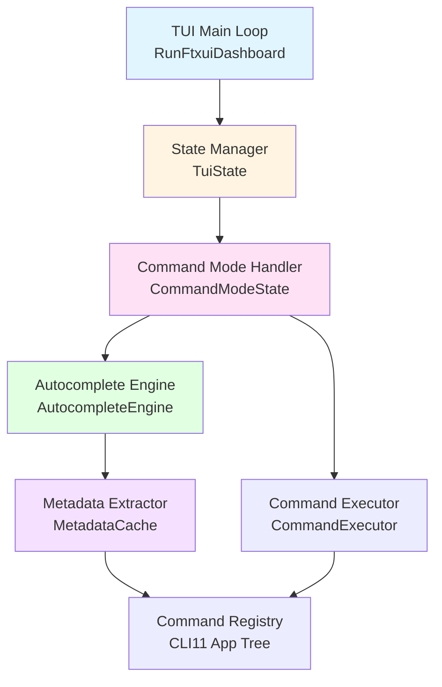
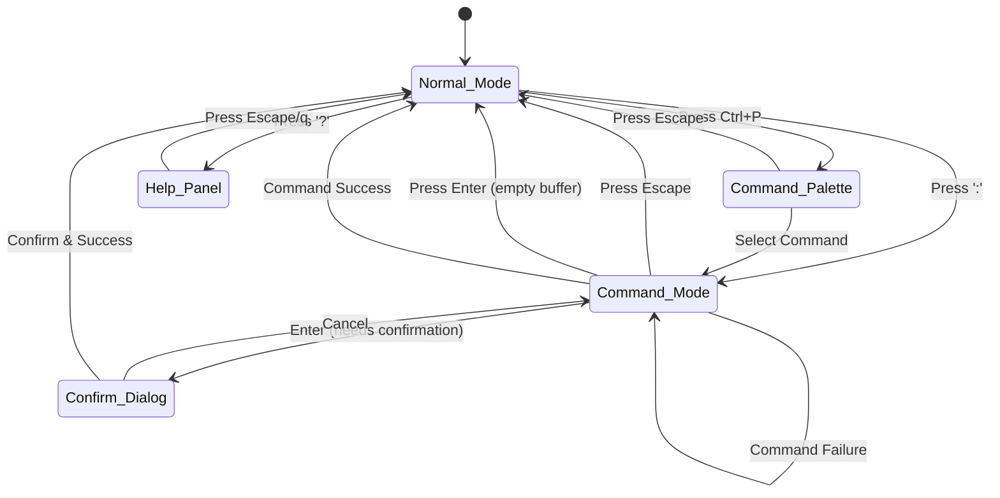
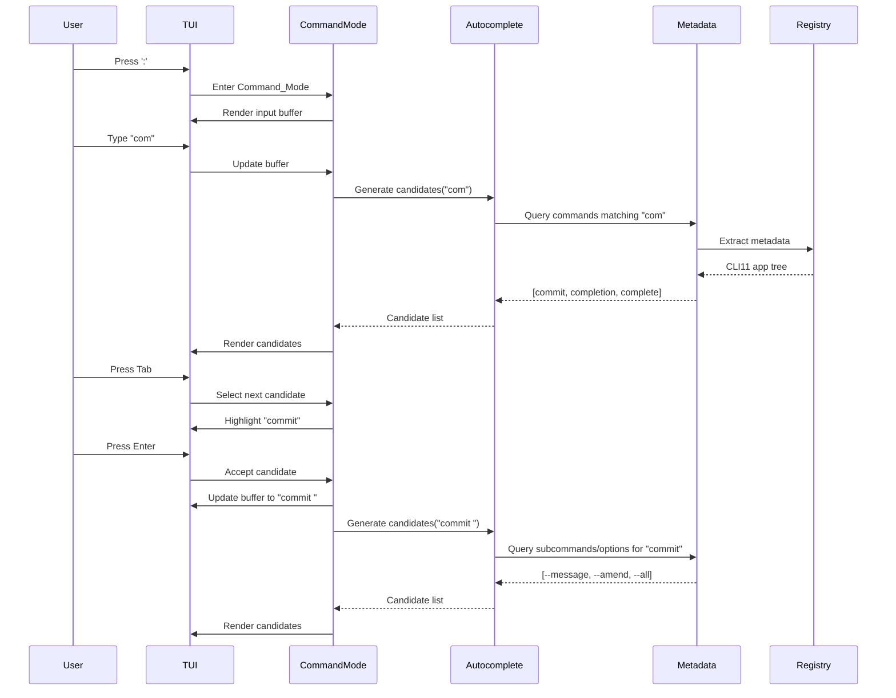

# Design Document: TUI Command Input Enhancement

## Overview

This document defines the design for adding a command input system with autocomplete to the kano-git TUI. The current TUI implementation (`tui_cmd.cpp`) only supports single-key shortcuts, which creates a steep learning curve and limits discoverability. This enhancement introduces a vim-style command mode (`:command`) with intelligent autocomplete, making the TUI more intuitive and powerful.

### Goals

- Add a command input mode accessible via `:` key (similar to vim)
- Provide real-time autocomplete suggestions from the existing Command_Registry
- Display command descriptions and usage hints inline
- Maintain backward compatibility with existing single-key shortcuts
- Ensure sub-100ms responsiveness for autocomplete operations

### Non-Goals

- Replacing the existing single-key shortcut system
- Adding new git commands (only exposing existing ones via command input)
- Implementing command history or persistence across sessions (future enhancement)
- Supporting multi-line command input

### Key Design Principles

1. **Single Source of Truth**: All command metadata comes from the existing Command_Registry (via CLI11 app tree). No duplicate command definitions.
2. **Non-Blocking UI**: Autocomplete generation must not block user input
3. **Progressive Disclosure**: Show relevant information at each input stage (commands → subcommands → options)
4. **Graceful Degradation**: System continues functioning if autocomplete fails

## Architecture

### High-Level Component Diagram



### Component Responsibilities


#### TUI Main Loop (RunFtxuiDashboard)
- Existing FTXUI event loop in `tui_cmd.cpp`
- Dispatches keyboard events to State Manager
- Renders UI components based on current state

#### State Manager (TuiState)
- Manages global TUI state (Normal_Mode vs Command_Mode)
- Routes events to appropriate handlers
- Coordinates transitions between modes

#### Command Mode Handler (CommandModeState)
- Manages Input_Buffer (text content and cursor position)
- Handles keyboard input (typing, editing, navigation)
- Triggers autocomplete on buffer changes
- Executes commands on Enter key

#### Autocomplete Engine (AutocompleteEngine)
- Generates candidate lists based on Input_Buffer
- Implements context-aware completion (commands → subcommands → options)
- Sorts and limits candidates (max 10 items)
- Provides candidate metadata (name, description, type)

#### Metadata Extractor (MetadataCache)
- Extracts command metadata from CLI11 app tree
- Caches metadata for performance (invalidated on registry changes)
- Provides query interface for autocomplete engine
- Reuses logic from existing `meta_cmd.cpp`

#### Command Executor (CommandExecutor)
- Parses command strings into CLI11 invocations
- Executes commands through existing command handlers
- Returns execution results (success/error messages)
- Handles confirmation dialogs for destructive operations

### State Machine



### Data Flow



## Components and Interfaces

### TuiState (State Manager)

```cpp
enum class TuiMode {
    Normal,
    Command,
    CommandPalette,
    Help,
    Confirm
};

struct TuiState {
    TuiMode mode = TuiMode::Normal;
    CommandModeState command_state;
    CommandPaletteState palette_state;
    ConfirmState confirm_state;  // Already exists
    std::string footer_message;
    bool footer_is_error = false;
    
    // Event handlers
    auto HandleEvent(ftxui::Event event) -> bool;
    auto Render() -> ftxui::Element;
    
private:
    auto HandleNormalMode(ftxui::Event event) -> bool;
    auto HandleCommandMode(ftxui::Event event) -> bool;
    auto HandlePaletteMode(ftxui::Event event) -> bool;
    auto HandleHelpMode(ftxui::Event event) -> bool;
};
```

### CommandModeState (Command Input Handler)

```cpp
struct CommandModeState {
    std::string buffer;
    size_t cursor_pos = 0;
    std::vector<CandidateItem> candidates;
    int selected_candidate = 0;
    bool show_candidates = false;
    
    // Input handling
    auto OnCharacter(char ch) -> void;
    auto OnBackspace() -> void;
    auto OnDelete() -> void;
    auto OnClearBuffer() -> void;  // Ctrl+U
    
    // Cursor navigation
    auto OnCursorLeft() -> void;
    auto OnCursorRight() -> void;
    auto OnHome() -> void;
    auto OnEnd() -> void;
    
    // Candidate navigation
    auto OnNextCandidate() -> void;  // Tab, Down
    auto OnPrevCandidate() -> void;  // Shift+Tab, Up
    auto OnAcceptCandidate() -> void;  // Enter with candidate selected
    
    // Command execution
    auto OnExecute() -> ExecutionResult;
    
    // Autocomplete trigger
    auto UpdateCandidates(AutocompleteEngine& engine) -> void;
    
    // Rendering
    auto RenderInputLine() -> ftxui::Element;
    auto RenderCandidateList() -> ftxui::Element;
};

struct CandidateItem {
    std::string text;           // "commit", "--message", "push"
    std::string description;    // "Record changes to repository"
    CandidateType type;         // Command, Subcommand, Option
    std::string completion;     // Full text to insert
};

enum class CandidateType {
    Command,
    Subcommand,
    Option,
    OptionValue
};
```

### AutocompleteEngine (Completion Logic)

```cpp
class AutocompleteEngine {
public:
    explicit AutocompleteEngine(std::shared_ptr<MetadataCache> metadata);
    
    // Main completion interface
    auto GenerateCandidates(const std::string& input) -> std::vector<CandidateItem>;
    
private:
    std::shared_ptr<MetadataCache> metadata_;
    
    // Context detection
    auto ParseInput(const std::string& input) -> InputContext;
    
    // Completion strategies
    auto CompleteCommand(const std::string& prefix) -> std::vector<CandidateItem>;
    auto CompleteSubcommand(const std::string& command, const std::string& prefix) 
        -> std::vector<CandidateItem>;
    auto CompleteOption(const std::string& command, const std::string& prefix) 
        -> std::vector<CandidateItem>;
    
    // Filtering and sorting
    auto FilterAndSort(std::vector<CandidateItem> candidates, size_t max_count) 
        -> std::vector<CandidateItem>;
};

struct InputContext {
    std::vector<std::string> tokens;
    std::string current_token;
    CompletionPhase phase;  // Command, Subcommand, Option, OptionValue
    std::string command_name;
};

enum class CompletionPhase {
    Command,      // "com" -> complete command names
    Subcommand,   // "worktree " -> complete subcommands
    Option,       // "commit -" -> complete options
    OptionValue   // "commit --message " -> complete values (future)
};
```

### MetadataCache (Command Metadata)

```cpp
struct CommandMetadata {
    std::string name;
    std::string description;
    std::vector<std::string> subcommands;
    std::vector<OptionMetadata> options;
    bool allow_extras;
};

struct OptionMetadata {
    std::vector<std::string> long_names;   // ["message"]
    std::vector<std::string> short_names;  // ["m"]
    std::string description;
    bool takes_value;
    bool required;
    bool multi;
    std::string default_value;
};

class MetadataCache {
public:
    explicit MetadataCache(const CLI::App& app);
    
    // Query interface
    auto GetAllCommands() -> std::vector<CommandMetadata>;
    auto GetCommand(const std::string& name) -> std::optional<CommandMetadata>;
    auto GetSubcommands(const std::string& command) -> std::vector<std::string>;
    auto GetOptions(const std::string& command) -> std::vector<OptionMetadata>;
    
    // Cache management
    auto Refresh(const CLI::App& app) -> void;
    
private:
    std::unordered_map<std::string, CommandMetadata> commands_;
    
    // Extraction (reuse from meta_cmd.cpp)
    auto ExtractMetadata(const CLI::App& app) -> void;
    auto ExtractCommand(const CLI::App* cmd, const std::string& path) -> CommandMetadata;
    auto ExtractOptions(const CLI::App* cmd) -> std::vector<OptionMetadata>;
};
```

### CommandExecutor (Execution Logic)

```cpp
struct ExecutionResult {
    bool success;
    std::string message;
    bool needs_confirmation;
    std::function<void()> confirmed_action;
};

class CommandExecutor {
public:
    explicit CommandExecutor(CLI::App& app, const std::filesystem::path& repo);
    
    auto Execute(const std::string& command_line) -> ExecutionResult;
    
private:
    CLI::App& app_;
    std::filesystem::path repo_;
    
    auto ParseCommandLine(const std::string& input) -> std::vector<std::string>;
    auto NeedsConfirmation(const std::string& command) -> bool;
    auto BuildConfirmationMessage(const std::string& command) -> std::string;
};
```

### CommandPaletteState (Command Browser)

```cpp
struct CommandPaletteState {
    std::vector<PaletteItem> all_commands;
    std::vector<PaletteItem> filtered_commands;
    std::string search_query;
    int selected_index = 0;
    
    auto UpdateFilter(const std::string& query) -> void;
    auto OnSelectCommand() -> std::string;  // Returns command name
    auto Render() -> ftxui::Element;
};

struct PaletteItem {
    std::string name;
    std::string description;
    std::string category;  // "Repository", "History", "Navigation", "System"
};
```

## Data Models

### Input Buffer Model

The input buffer maintains both the text content and cursor position:

```cpp
struct InputBuffer {
    std::string text;
    size_t cursor_pos;  // 0-based index, can equal text.length()
    
    auto Insert(char ch) -> void {
        text.insert(cursor_pos, 1, ch);
        cursor_pos++;
    }
    
    auto Backspace() -> void {
        if (cursor_pos > 0) {
            text.erase(cursor_pos - 1, 1);
            cursor_pos--;
        }
    }
    
    auto Delete() -> void {
        if (cursor_pos < text.length()) {
            text.erase(cursor_pos, 1);
        }
    }
    
    auto Clear() -> void {
        text.clear();
        cursor_pos = 0;
    }
    
    auto MoveCursor(int delta) -> void {
        cursor_pos = std::clamp(cursor_pos + delta, 
                                size_t{0}, 
                                text.length());
    }
};
```

### Candidate Selection Model

Candidate selection uses circular navigation:

```cpp
struct CandidateSelection {
    std::vector<CandidateItem> items;
    int selected_index;
    
    auto SelectNext() -> void {
        if (items.empty()) return;
        selected_index = (selected_index + 1) % items.size();
    }
    
    auto SelectPrev() -> void {
        if (items.empty()) return;
        selected_index = (selected_index - 1 + items.size()) % items.size();
    }
    
    auto GetSelected() -> std::optional<CandidateItem> {
        if (items.empty() || selected_index < 0 || 
            selected_index >= items.size()) {
            return std::nullopt;
        }
        return items[selected_index];
    }
};
```

### Command Metadata Model

Command metadata is extracted from CLI11 and cached:

```cpp
// Example metadata for "commit" command
CommandMetadata {
    .name = "commit",
    .description = "Record changes to the repository",
    .subcommands = {},  // No subcommands
    .options = {
        OptionMetadata {
            .long_names = {"message"},
            .short_names = {"m"},
            .description = "Commit message",
            .takes_value = true,
            .required = false,
            .multi = false,
            .default_value = ""
        },
        OptionMetadata {
            .long_names = {"all"},
            .short_names = {"a"},
            .description = "Stage all modified files",
            .takes_value = false,
            .required = false,
            .multi = false,
            .default_value = ""
        }
    },
    .allow_extras = false
};

// Example metadata for "worktree" command
CommandMetadata {
    .name = "worktree",
    .description = "Manage working trees",
    .subcommands = {"add", "list", "remove", "prune"},
    .options = {},
    .allow_extras = false
};
```


## Correctness Properties

*A property is a characteristic or behavior that should hold true across all valid executions of a system—essentially, a formal statement about what the system should do. Properties serve as the bridge between human-readable specifications and machine-verifiable correctness guarantees.*

### Property Reflection

After analyzing all 78 acceptance criteria, I identified several areas of redundancy:

1. **Navigation properties (2.4-2.7, 5.2-5.7)**: Multiple properties about cursor/selection movement can be consolidated into fewer comprehensive properties
2. **Candidate display properties (4.1-4.6)**: Several UI rendering properties can be combined
3. **Mode transition properties (1.1, 1.4, 1.6)**: Can be unified into a single mode transition property
4. **Performance properties (12.1-12.3)**: Multiple latency requirements can be tested together
5. **Error handling properties (11.1-11.6)**: Can be consolidated into fewer comprehensive error handling properties

The following properties represent the minimal set needed to validate all requirements without redundancy:

### Property 1: Mode Transition Correctness

*For any* TUI state in Normal_Mode, entering Command_Mode (via ':') and then exiting (via Escape or Enter with empty buffer) should return to Normal_Mode with cleared input buffer.

**Validates: Requirements 1.1, 1.4, 1.6**

### Property 2: Input Buffer Editing Preserves Invariants

*For any* sequence of character insertions, deletions (Backspace), and cursor movements (Left/Right/Home/End), the cursor position should always satisfy: 0 ≤ cursor_pos ≤ buffer.length().

**Validates: Requirements 2.1, 2.2, 2.4, 2.5, 2.6, 2.7**

### Property 3: Buffer Clear is Idempotent

*For any* Input_Buffer state, pressing Ctrl+U should result in an empty buffer, and pressing Ctrl+U again should maintain the empty buffer state.

**Validates: Requirements 2.3**

### Property 4: Autocomplete Candidate Matching

*For any* non-empty Input_Buffer containing a partial command name, all candidates returned by the Autocomplete_Engine should be valid commands from Command_Registry that match the input prefix (case-insensitive).

**Validates: Requirements 3.1, 3.2, 6.1, 6.3**

### Property 5: Context-Aware Completion

*For any* complete command name followed by a space in the Input_Buffer, the Autocomplete_Engine should return only subcommands or options that belong to that specific command according to Command_Metadata.

**Validates: Requirements 3.3, 3.4, 6.4, 6.5**

### Property 6: Candidate List Constraints

*For any* generated Candidate_List, it should be sorted alphabetically and contain at most 10 items.

**Validates: Requirements 3.6, 3.7**

### Property 7: Empty Candidate List for Non-Matching Input

*For any* Input_Buffer content that does not match any command, subcommand, or option in Command_Registry, the Autocomplete_Engine should return an empty Candidate_List.

**Validates: Requirements 3.5**

### Property 8: Candidate Display Completeness

*For any* non-empty Candidate_List, the rendered UI should display each candidate with both its name and description, with the first candidate selected by default.

**Validates: Requirements 4.1, 4.2, 4.3, 4.4, 4.5, 4.6, 5.1**

### Property 9: Candidate Selection Wrapping

*For any* Candidate_List with N items, navigating forward from index N-1 should wrap to index 0, and navigating backward from index 0 should wrap to index N-1.

**Validates: Requirements 5.6, 5.7**

### Property 10: Candidate Navigation Consistency

*For any* Candidate_List, pressing Tab/Down should move selection forward, and pressing Shift+Tab/Up should move selection backward, with both navigation methods producing equivalent results.

**Validates: Requirements 5.2, 5.3, 5.4, 5.5**

### Property 11: Candidate Acceptance Updates Buffer

*For any* selected candidate in the Candidate_List, pressing Enter should update the Input_Buffer to contain the candidate's completion text followed by a space.

**Validates: Requirements 5.9**

### Property 12: Metadata Synchronization

*For any* command registered via RegisterAll in Command_Registry, the command's metadata (name, description, options, subcommands) should be automatically available to the Autocomplete_Engine without requiring code changes.

**Validates: Requirements 6.6**

### Property 13: Command Execution Success Flow

*For any* valid command in the Input_Buffer, pressing Enter should execute the command, and if execution succeeds, the TUI should return to Normal_Mode and display a success message.

**Validates: Requirements 7.1, 7.2**

### Property 14: Command Execution Failure Flow

*For any* command execution that fails, the TUI should display an error message in the footer and remain in Command_Mode to allow correction.

**Validates: Requirements 7.3**

### Property 15: Unknown Command Error Format

*For any* Input_Buffer content that does not match a registered command, pressing Enter should display an error message in the format "Unknown command: <command>".

**Validates: Requirements 7.5**

### Property 16: Confirmation Dialog for Destructive Commands

*For any* command that requires confirmation (push, commit with --force, etc.), pressing Enter should display a confirmation dialog before execution, not execute immediately.

**Validates: Requirements 7.4**

### Property 17: Command Palette Completeness

*For any* state where Command_Palette is displayed (via Ctrl+P), the palette should list all commands registered in Command_Registry with their descriptions, grouped by category.

**Validates: Requirements 8.1, 8.2, 8.3**

### Property 18: Command Palette Selection Pre-fills Buffer

*For any* command selected from the Command_Palette, the TUI should enter Command_Mode with the Input_Buffer pre-filled with the selected command name.

**Validates: Requirements 8.4**

### Property 19: Command Palette Fuzzy Search

*For any* search query entered in the Command_Palette, the filtered results should include all commands whose name or description contains the query substring (case-insensitive).

**Validates: Requirements 8.6**

### Property 20: Command Palette Dismissal

*For any* Command_Palette state, pressing Escape should close the palette and return to Normal_Mode.

**Validates: Requirements 8.5**

### Property 21: Backward Compatibility with Single-Key Shortcuts

*For any* single-key shortcut (r, d, f, c, C, p, P, Enter, q) pressed in Normal_Mode, the TUI should execute the corresponding action as it did before the command input enhancement.

**Validates: Requirements 9.1, 9.2**

### Property 22: Mode Isolation for Shortcuts

*For any* character typed in Command_Mode, the TUI should NOT trigger single-key shortcut actions, but instead append the character to the Input_Buffer.

**Validates: Requirements 9.3**

### Property 23: Help Panel Completeness

*For any* state where the help panel is displayed (via "help" command or '?' key), the panel should list all available commands with syntax and descriptions, plus instructions for Command_Mode and autocomplete usage.

**Validates: Requirements 10.2, 10.3, 10.4**

### Property 24: Help Panel Activation and Dismissal

*For any* Normal_Mode state, pressing '?' should display the help panel, and pressing Escape or 'q' in the help panel should return to Normal_Mode.

**Validates: Requirements 10.5, 10.6**

### Property 25: Parse Error Message Format

*For any* command that fails to parse, the TUI should display an error message in the format "Invalid command syntax: <details>" in the footer.

**Validates: Requirements 11.1**

### Property 26: Git Error Propagation

*For any* command execution that encounters a git operation error, the TUI should display the error message from the underlying git command in the footer.

**Validates: Requirements 11.2**

### Property 27: Autocomplete Error Resilience

*For any* failure in the Autocomplete_Engine (metadata unavailable, generation error), the TUI should log the error and continue functioning without crashing, optionally disabling autocomplete.

**Validates: Requirements 11.3, 11.4**

### Property 28: Error Message Lifecycle

*For any* error message displayed in the footer, starting to type a new command in Command_Mode should clear the error message.

**Validates: Requirements 11.5**

### Property 29: Progress Feedback for Long Operations

*For any* long-running command (fetch, push, etc.), the TUI should display progress messages (e.g., "Fetching...", "Pushing...") during execution.

**Validates: Requirements 11.6**

### Property 30: Input Responsiveness

*For any* character typed in Command_Mode, the Input_Buffer display should update within 50ms, and the Autocomplete_Engine should generate candidates within 100ms, and the UI should refresh within 50ms.

**Validates: Requirements 12.1, 12.2, 12.3**

### Property 31: Non-Blocking Autocomplete

*For any* autocomplete candidate generation in progress, the TUI should continue accepting user input without blocking.

**Validates: Requirements 12.5**

### Property 32: Autocomplete Scalability

*For any* Command_Registry containing more than 100 commands, the Autocomplete_Engine should maintain sub-100ms response time for candidate generation.

**Validates: Requirements 12.6**

### Property 33: Command Category Support

*For any* command in the categories {refresh, commit, push, fetch, cherry-pick, rebase, history, filter}, the TUI should support executing that command via Command_Mode.

**Validates: Requirements 7.6**

### Property 34: Footer Help Display

*For any* TUI state, the footer should display help text that includes both single-key shortcuts and command input instructions.

**Validates: Requirements 9.4**

## Error Handling

### Error Categories

1. **User Input Errors**
   - Invalid command syntax
   - Unknown command names
   - Missing required options
   - Invalid option values

2. **System Errors**
   - Metadata extraction failure
   - Autocomplete engine failure
   - Command execution failure
   - Git operation errors

3. **State Errors**
   - Invalid mode transitions
   - Corrupted input buffer state
   - Invalid candidate selection

### Error Handling Strategy

#### User Input Errors

```cpp
auto CommandExecutor::Execute(const std::string& command_line) -> ExecutionResult {
    try {
        auto tokens = ParseCommandLine(command_line);
        if (tokens.empty()) {
            return {false, "Empty command", false, nullptr};
        }
        
        // Check if command exists
        auto cmd = app_.get_subcommand(tokens[0]);
        if (!cmd) {
            return {false, "Unknown command: " + tokens[0], false, nullptr};
        }
        
        // Parse and validate options
        try {
            cmd->parse(tokens);
        } catch (const CLI::ParseError& e) {
            return {false, "Invalid command syntax: " + e.what(), false, nullptr};
        }
        
        // Execute command
        // ...
        
    } catch (const std::exception& e) {
        return {false, "Command execution failed: " + std::string(e.what()), 
                false, nullptr};
    }
}
```

#### System Errors

```cpp
auto AutocompleteEngine::GenerateCandidates(const std::string& input) 
    -> std::vector<CandidateItem> {
    try {
        auto context = ParseInput(input);
        
        switch (context.phase) {
            case CompletionPhase::Command:
                return CompleteCommand(context.current_token);
            case CompletionPhase::Subcommand:
                return CompleteSubcommand(context.command_name, context.current_token);
            case CompletionPhase::Option:
                return CompleteOption(context.command_name, context.current_token);
            default:
                return {};
        }
    } catch (const std::exception& e) {
        // Log error but don't crash
        std::cerr << "Autocomplete error: " << e.what() << std::endl;
        return {};  // Return empty list on error
    }
}
```

#### Graceful Degradation

If metadata extraction fails, the system should:
1. Display "Command metadata unavailable" message
2. Disable autocomplete functionality
3. Continue allowing manual command input
4. Allow single-key shortcuts to function normally

```cpp
auto TuiState::Initialize(CLI::App& app) -> void {
    try {
        metadata_cache_ = std::make_shared<MetadataCache>(app);
        autocomplete_engine_ = std::make_unique<AutocompleteEngine>(metadata_cache_);
        autocomplete_enabled_ = true;
    } catch (const std::exception& e) {
        std::cerr << "Failed to initialize autocomplete: " << e.what() << std::endl;
        footer_message = "Command metadata unavailable - autocomplete disabled";
        footer_is_error = true;
        autocomplete_enabled_ = false;
        // Continue without autocomplete
    }
}
```

### Error Message Guidelines

1. **Be Specific**: Include details about what went wrong
   - Bad: "Command failed"
   - Good: "Unknown command: comit (did you mean 'commit'?)"

2. **Be Actionable**: Tell users how to fix the problem
   - Bad: "Invalid syntax"
   - Good: "Invalid command syntax: missing required option --message"

3. **Be Consistent**: Use standard formats
   - Parse errors: "Invalid command syntax: <details>"
   - Unknown commands: "Unknown command: <command>"
   - Git errors: "<git error message>"

4. **Clear on User Action**: Error messages should clear when user starts typing a new command

## Testing Strategy

### Dual Testing Approach

This feature requires both unit tests and property-based tests for comprehensive coverage:

- **Unit tests**: Verify specific examples, edge cases, and integration points
- **Property tests**: Verify universal properties across all inputs using randomized testing

Both approaches are complementary and necessary. Unit tests catch concrete bugs in specific scenarios, while property tests verify general correctness across a wide input space.

### Property-Based Testing

We will use **Catch2 with Catch2's generators** for property-based testing in C++. Each property test will:

- Run a minimum of 100 iterations with randomized inputs
- Reference the design document property it validates
- Use the tag format: `[Feature: tui-command-input-enhancement][Property N: <property_text>]`

Example property test structure:

```cpp
TEST_CASE("Mode transition correctness", 
          "[Feature: tui-command-input-enhancement]"
          "[Property 1: Mode transition round-trip]") {
    
    auto initial_state = GENERATE(take(100, random_tui_state()));
    
    REQUIRE(initial_state.mode == TuiMode::Normal);
    
    // Enter Command_Mode
    initial_state.HandleEvent(ftxui::Event::Character(':'));
    REQUIRE(initial_state.mode == TuiMode::Command);
    
    // Add some input
    auto input = GENERATE(take(1, random_string(1, 20)));
    for (char ch : input) {
        initial_state.HandleEvent(ftxui::Event::Character(ch));
    }
    
    // Exit via Escape
    initial_state.HandleEvent(ftxui::Event::Escape);
    
    // Verify return to Normal_Mode with cleared buffer
    REQUIRE(initial_state.mode == TuiMode::Normal);
    REQUIRE(initial_state.command_state.buffer.empty());
    REQUIRE(initial_state.command_state.cursor_pos == 0);
}
```

### Unit Testing Focus Areas

Unit tests should focus on:

1. **Specific Examples**
   - Typing "commit" and getting commit command candidates
   - Typing "worktree " and getting subcommand candidates
   - Typing "commit -" and getting option candidates

2. **Edge Cases**
   - Empty input buffer behavior
   - Single candidate in list (auto-completion)
   - Cursor at buffer boundaries
   - Very long command strings
   - Special characters in input

3. **Integration Points**
   - Metadata extraction from CLI11 app tree
   - Command execution through existing handlers
   - UI rendering with FTXUI components
   - Event routing between components

4. **Error Conditions**
   - Unknown command handling
   - Parse error handling
   - Metadata extraction failure
   - Autocomplete engine failure

### Test Organization

```
tests/
├── unit/
│   ├── test_command_mode_state.cpp
│   ├── test_autocomplete_engine.cpp
│   ├── test_metadata_cache.cpp
│   ├── test_command_executor.cpp
│   └── test_input_buffer.cpp
├── property/
│   ├── test_mode_transitions.cpp
│   ├── test_input_editing.cpp
│   ├── test_autocomplete_matching.cpp
│   ├── test_candidate_navigation.cpp
│   └── test_error_handling.cpp
└── integration/
    ├── test_end_to_end_flow.cpp
    └── test_backward_compatibility.cpp
```

### Test Data Generation

For property-based tests, we need generators for:

```cpp
// Random TUI states
auto random_tui_state() -> Catch::Generators::GeneratorWrapper<TuiState>;

// Random command strings
auto random_command_string() -> Catch::Generators::GeneratorWrapper<std::string>;

// Random valid commands from registry
auto random_valid_command() -> Catch::Generators::GeneratorWrapper<std::string>;

// Random input buffer states
auto random_input_buffer() -> Catch::Generators::GeneratorWrapper<InputBuffer>;

// Random candidate lists
auto random_candidate_list(size_t min, size_t max) 
    -> Catch::Generators::GeneratorWrapper<std::vector<CandidateItem>>;
```

### Performance Testing

Performance requirements (sub-100ms response times) should be validated with:

1. **Microbenchmarks**: Measure individual component performance
   - Metadata extraction time
   - Candidate generation time
   - UI rendering time

2. **Load Tests**: Test with large command sets (100+ commands)
   - Verify autocomplete remains responsive
   - Verify no memory leaks during extended use

3. **Profiling**: Identify bottlenecks if performance requirements are not met
   - Use profiling tools (perf, valgrind, etc.)
   - Optimize hot paths

### Continuous Integration

All tests should run in CI on every commit:

```bash
# Run all tests
cmake --build build --target test

# Run only property tests
ctest -R "Property.*"

# Run only unit tests
ctest -R "Unit.*"

# Run with coverage
cmake -DCMAKE_BUILD_TYPE=Coverage ..
cmake --build . --target coverage
```


## Implementation Details

### Integration with Existing TUI

The existing TUI in `tui_cmd.cpp` uses FTXUI's component system. We'll integrate the command input system by:

1. **Adding State to RunFtxuiDashboard**: Extend the existing state variables with `TuiState`
2. **Event Routing**: Modify the event handler to route events based on current mode
3. **Rendering**: Add command input UI elements to the existing layout

### Metadata Extraction

Reuse the existing `meta_cmd.cpp` logic for extracting metadata from CLI11:

```cpp
// In MetadataCache constructor
MetadataCache::MetadataCache(const CLI::App& app) {
    ExtractMetadata(app);
}

auto MetadataCache::ExtractMetadata(const CLI::App& app) -> void {
    // Get all top-level subcommands
    const auto subcommands = app.get_subcommands([](const CLI::App* sub) {
        return sub != nullptr && !sub->get_name().empty();
    });
    
    for (const auto* cmd : subcommands) {
        auto metadata = ExtractCommand(cmd, cmd->get_name());
        commands_[metadata.name] = std::move(metadata);
    }
}
```


### Autocomplete Algorithm

The autocomplete engine uses a multi-phase approach:

**Phase 1: Parse Input Context**

```cpp
auto AutocompleteEngine::ParseInput(const std::string& input) -> InputContext {
    InputContext ctx;
    
    // Tokenize by whitespace
    std::istringstream iss(input);
    std::string token;
    while (iss >> token) {
        ctx.tokens.push_back(token);
    }
    
    // Determine current token (may be incomplete)
    if (input.empty() || std::isspace(input.back())) {
        ctx.current_token = "";
    } else {
        ctx.current_token = ctx.tokens.empty() ? "" : ctx.tokens.back();
        if (!ctx.tokens.empty()) ctx.tokens.pop_back();
    }
    
    // Determine completion phase
    if (ctx.tokens.empty()) {
        ctx.phase = CompletionPhase::Command;
    } else {
        ctx.command_name = ctx.tokens[0];
        if (ctx.current_token.starts_with("-")) {
            ctx.phase = CompletionPhase::Option;
        } else {
            ctx.phase = CompletionPhase::Subcommand;
        }
    }
    
    return ctx;
}
```


**Phase 2: Generate Candidates**

```cpp
auto AutocompleteEngine::CompleteCommand(const std::string& prefix) 
    -> std::vector<CandidateItem> {
    std::vector<CandidateItem> candidates;
    
    auto all_commands = metadata_->GetAllCommands();
    for (const auto& cmd : all_commands) {
        // Case-insensitive prefix match
        if (ToLowerAscii(cmd.name).starts_with(ToLowerAscii(prefix))) {
            candidates.push_back({
                .text = cmd.name,
                .description = cmd.description,
                .type = CandidateType::Command,
                .completion = cmd.name
            });
        }
    }
    
    return FilterAndSort(candidates, 10);
}

auto AutocompleteEngine::CompleteSubcommand(const std::string& command, 
                                             const std::string& prefix) 
    -> std::vector<CandidateItem> {
    std::vector<CandidateItem> candidates;
    
    auto cmd_meta = metadata_->GetCommand(command);
    if (!cmd_meta) return candidates;
    
    for (const auto& subcmd : cmd_meta->subcommands) {
        if (ToLowerAscii(subcmd).starts_with(ToLowerAscii(prefix))) {
            candidates.push_back({
                .text = subcmd,
                .description = "Subcommand of " + command,
                .type = CandidateType::Subcommand,
                .completion = subcmd
            });
        }
    }
    
    return FilterAndSort(candidates, 10);
}
```


**Phase 3: Filter and Sort**

```cpp
auto AutocompleteEngine::FilterAndSort(std::vector<CandidateItem> candidates, 
                                        size_t max_count) 
    -> std::vector<CandidateItem> {
    // Sort alphabetically by text
    std::sort(candidates.begin(), candidates.end(), 
              [](const auto& a, const auto& b) {
                  return a.text < b.text;
              });
    
    // Limit to max_count
    if (candidates.size() > max_count) {
        candidates.resize(max_count);
    }
    
    return candidates;
}
```

### Command Execution

Command execution reuses the existing CLI11 parsing infrastructure:

```cpp
auto CommandExecutor::Execute(const std::string& command_line) -> ExecutionResult {
    // Parse command line into tokens
    auto tokens = ParseCommandLine(command_line);
    if (tokens.empty()) {
        return {false, "Empty command", false, nullptr};
    }
    
    // Find command in CLI11 app
    CLI::App* cmd = nullptr;
    try {
        cmd = app_.get_subcommand(tokens[0]);
    } catch (...) {
        return {false, "Unknown command: " + tokens[0], false, nullptr};
    }
    
    if (!cmd) {
        return {false, "Unknown command: " + tokens[0], false, nullptr};
    }
    
    // Check if confirmation needed
    if (NeedsConfirmation(tokens[0])) {
        return {
            true, 
            BuildConfirmationMessage(tokens[0]),
            true,
            [this, tokens]() { ExecuteInternal(tokens); }
        };
    }
    
    // Execute directly
    return ExecuteInternal(tokens);
}
```


### UI Rendering with FTXUI

The command input UI consists of three main elements:

1. **Input Line**: Shows the prompt (`:`) and input buffer with cursor
2. **Candidate List**: Shows autocomplete suggestions above the input line
3. **Footer**: Shows help text and error messages

```cpp
auto CommandModeState::RenderInputLine() -> ftxui::Element {
    using namespace ftxui;
    
    // Build input text with cursor
    std::string display_text = buffer;
    if (cursor_pos < buffer.length()) {
        // Insert cursor marker
        display_text.insert(cursor_pos, "█");
    } else {
        display_text += "█";
    }
    
    return hbox({
        text(":") | bold,
        text(" "),
        text(display_text)
    }) | border;
}

auto CommandModeState::RenderCandidateList() -> ftxui::Element {
    using namespace ftxui;
    
    if (candidates.empty() || !show_candidates) {
        return text("");
    }
    
    std::vector<Element> items;
    for (size_t i = 0; i < candidates.size(); ++i) {
        const auto& candidate = candidates[i];
        auto item = hbox({
            text(candidate.text) | bold,
            text(" - "),
            text(candidate.description) | dim
        });
        
        if (i == selected_candidate) {
            item = item | inverted;  // Highlight selected
        }
        
        items.push_back(item);
    }
    
    return vbox(std::move(items)) | border;
}
```


### Event Handling

Event handling routes keyboard input based on current mode:

```cpp
auto TuiState::HandleEvent(ftxui::Event event) -> bool {
    switch (mode) {
        case TuiMode::Normal:
            return HandleNormalMode(event);
        case TuiMode::Command:
            return HandleCommandMode(event);
        case TuiMode::CommandPalette:
            return HandlePaletteMode(event);
        case TuiMode::Help:
            return HandleHelpMode(event);
        default:
            return false;
    }
}

auto TuiState::HandleCommandMode(ftxui::Event event) -> bool {
    // Handle special keys first
    if (event == ftxui::Event::Escape) {
        mode = TuiMode::Normal;
        command_state.buffer.clear();
        command_state.cursor_pos = 0;
        return true;
    }
    
    if (event == ftxui::Event::Return) {
        if (command_state.buffer.empty()) {
            mode = TuiMode::Normal;
        } else {
            auto result = executor_->Execute(command_state.buffer);
            if (result.needs_confirmation) {
                // Show confirmation dialog
                confirm_state.message = result.message;
                confirm_state.action = result.confirmed_action;
                mode = TuiMode::Confirm;
            } else if (result.success) {
                mode = TuiMode::Normal;
                footer_message = result.message;
                footer_is_error = false;
            } else {
                footer_message = result.message;
                footer_is_error = true;
                // Stay in Command_Mode for correction
            }
        }
        return true;
    }
    
    // Handle candidate navigation
    if (event == ftxui::Event::Tab || event == ftxui::Event::ArrowDown) {
        command_state.OnNextCandidate();
        return true;
    }
    
    if (event == ftxui::Event::TabReverse || event == ftxui::Event::ArrowUp) {
        command_state.OnPrevCandidate();
        return true;
    }
    
    // Handle editing
    if (event == ftxui::Event::Backspace) {
        command_state.OnBackspace();
        command_state.UpdateCandidates(*autocomplete_engine_);
        return true;
    }
    
    if (event == ftxui::Event::Delete) {
        command_state.OnDelete();
        command_state.UpdateCandidates(*autocomplete_engine_);
        return true;
    }
    
    // Handle cursor movement
    if (event == ftxui::Event::ArrowLeft) {
        command_state.OnCursorLeft();
        return true;
    }
    
    if (event == ftxui::Event::ArrowRight) {
        command_state.OnCursorRight();
        return true;
    }
    
    // Handle character input
    if (event.is_character()) {
        command_state.OnCharacter(event.character()[0]);
        command_state.UpdateCandidates(*autocomplete_engine_);
        return true;
    }
    
    return false;
}
```


## UI Design

### Layout Structure

The TUI layout in Command_Mode consists of:

```
┌─────────────────────────────────────────────────────────────┐
│                     Repository List                          │
│  (existing TUI content)                                      │
│                                                              │
│                                                              │
├─────────────────────────────────────────────────────────────┤
│ Autocomplete Candidates (when available)                    │
│ ┌─────────────────────────────────────────────────────────┐ │
│ │ commit - Record changes to the repository          [SEL]│ │
│ │ commit-push - Commit and push in one step               │ │
│ │ completion - Generate shell completion scripts          │ │
│ └─────────────────────────────────────────────────────────┘ │
├─────────────────────────────────────────────────────────────┤
│ Command Input                                                │
│ ┌─────────────────────────────────────────────────────────┐ │
│ │ : com█                                                   │ │
│ └─────────────────────────────────────────────────────────┘ │
├─────────────────────────────────────────────────────────────┤
│ Footer: Press ':' for command mode | Tab: next | Esc: cancel│
└─────────────────────────────────────────────────────────────┘
```

### Visual Design Principles

1. **Minimal Distraction**: Command input appears only when needed (`:` pressed)
2. **Clear Hierarchy**: Candidates above input, input above footer
3. **Visual Feedback**: Selected candidate is inverted/highlighted
4. **Cursor Visibility**: Use block cursor (█) for clear position indication
5. **Consistent Borders**: Use FTXUI border elements for visual separation


### Command Palette UI

The Command Palette (Ctrl+P) displays a full-screen overlay:

```
┌─────────────────────────────────────────────────────────────┐
│                     Command Palette                          │
│                                                              │
│ Search: █                                                    │
│                                                              │
│ Repository Operations                                        │
│   commit      - Record changes to the repository             │
│   push        - Update remote refs                           │
│   fetch       - Download objects from remote                 │
│   sync        - Synchronize with upstream                    │
│                                                              │
│ History                                                      │
│   tui         - Interactive repository browser               │
│                                                              │
│ Navigation                                                   │
│   worktree    - Manage working trees                         │
│   branch      - List, create, or delete branches             │
│                                                              │
│ System                                                       │
│   version     - Show version information                     │
│   help        - Display help information                     │
│                                                              │
│ Press Enter to select | Esc to cancel                        │
└─────────────────────────────────────────────────────────────┘
```

### Help Panel UI

The Help Panel ('?' or `:help`) displays usage instructions:

```
┌─────────────────────────────────────────────────────────────┐
│                         Help                                 │
│                                                              │
│ Command Mode                                                 │
│   :              Enter command mode                          │
│   Esc            Exit command mode                           │
│   Enter          Execute command                             │
│   Tab / Down     Next candidate                              │
│   Shift+Tab / Up Previous candidate                          │
│   Ctrl+U         Clear input                                 │
│                                                              │
│ Single-Key Shortcuts (Normal Mode)                           │
│   r              Refresh repository list                     │
│   d              Toggle dirty-only filter                    │
│   f              Fetch from remote                           │
│   c / C          Commit changes                              │
│   p / P          Push to remote                              │
│   Enter          View commit history                         │
│   q              Quit                                        │
│                                                              │
│ Other                                                        │
│   Ctrl+P         Open command palette                        │
│   ?              Show this help                              │
│                                                              │
│ Press Esc or q to close                                      │
└─────────────────────────────────────────────────────────────┘
```


## Performance Considerations

### Optimization Strategies

1. **Metadata Caching**
   - Extract metadata once at TUI startup
   - Cache in memory for fast lookups
   - Only refresh if Command_Registry changes (rare)

2. **Lazy Candidate Generation**
   - Generate candidates only when Input_Buffer changes
   - Debounce rapid typing (wait for typing pause)
   - Cancel in-flight generation if new input arrives

3. **Efficient String Matching**
   - Use prefix matching (not substring) for O(n) complexity
   - Pre-lowercase command names for case-insensitive comparison
   - Early exit when max candidates (10) reached

4. **UI Rendering Optimization**
   - Only re-render changed components
   - Use FTXUI's built-in caching
   - Limit candidate list to 10 items to reduce render cost

### Performance Targets

| Operation | Target | Measurement |
|-----------|--------|-------------|
| Input buffer update | < 50ms | Time from keypress to display update |
| Candidate generation | < 100ms | Time to generate candidate list |
| UI refresh | < 50ms | Time to render updated UI |
| Metadata extraction | < 500ms | One-time cost at startup |
| Command execution | Variable | Depends on git operation |

### Profiling Points

Key areas to profile if performance issues arise:

1. **Metadata Extraction**: `MetadataCache::ExtractMetadata()`
2. **Candidate Generation**: `AutocompleteEngine::GenerateCandidates()`
3. **String Matching**: `CompleteCommand()`, `CompleteSubcommand()`, `CompleteOption()`
4. **UI Rendering**: `RenderInputLine()`, `RenderCandidateList()`


## Security Considerations

### Input Validation

1. **Command Injection Prevention**
   - All commands go through CLI11 parsing (no shell execution of raw input)
   - Command execution uses existing command handlers (no `system()` calls)
   - No direct shell command construction from user input

2. **Buffer Overflow Prevention**
   - Use `std::string` for input buffer (automatic memory management)
   - Limit input buffer size to reasonable maximum (e.g., 1024 characters)
   - Validate cursor position bounds before access

3. **Metadata Validation**
   - Validate CLI11 app tree structure before extraction
   - Handle malformed metadata gracefully (empty lists, null pointers)
   - Sanitize command descriptions for display (escape special characters)

### Error Handling Security

1. **Information Disclosure**
   - Don't expose internal paths in error messages
   - Sanitize git error messages before display
   - Log detailed errors to stderr, show user-friendly messages in UI

2. **Denial of Service**
   - Limit candidate list size (max 10 items)
   - Timeout long-running autocomplete operations
   - Prevent infinite loops in candidate generation

## Backward Compatibility

### Preserving Existing Behavior

1. **Single-Key Shortcuts**: All existing shortcuts continue to work in Normal_Mode
2. **Command Execution**: Existing command handlers are reused (no behavior changes)
3. **UI Layout**: Command input appears only when explicitly activated (`:`)
4. **Configuration**: No new configuration required (feature works out-of-box)

### Migration Path

Users can adopt the new command input system gradually:

1. **Phase 1**: Continue using single-key shortcuts (no change required)
2. **Phase 2**: Try command mode for complex operations (`:commit --amend`)
3. **Phase 3**: Use command palette (Ctrl+P) to discover new commands
4. **Phase 4**: Adopt command mode as primary interface (optional)

### Deprecation Policy

No existing features are deprecated. Single-key shortcuts remain fully supported indefinitely.


## Future Enhancements

### Out of Scope for Initial Release

The following features are explicitly out of scope for the initial implementation but may be considered for future releases:

1. **Command History**
   - Up/Down arrow to navigate previous commands
   - Persistent history across sessions
   - History search (Ctrl+R)

2. **Advanced Completion**
   - File path completion for commands that take file arguments
   - Branch name completion for git operations
   - Fuzzy matching (not just prefix matching)
   - Completion for option values (e.g., `--format <tab>`)

3. **Command Aliases**
   - User-defined command shortcuts
   - Alias expansion in autocomplete

4. **Multi-Line Commands**
   - Line continuation with backslash
   - Multi-line editing support

5. **Command Preview**
   - Show what a command will do before execution
   - Dry-run mode for destructive operations

6. **Syntax Highlighting**
   - Color-code command parts (command, options, values)
   - Highlight errors in real-time

7. **Smart Suggestions**
   - Context-aware suggestions based on repository state
   - "Did you mean?" suggestions for typos
   - Recently used commands

### Extension Points

The design includes extension points for future enhancements:

1. **Completion Strategies**: `AutocompleteEngine` can be extended with new completion phases
2. **Candidate Sources**: `MetadataCache` can be extended to include dynamic data (branches, files)
3. **UI Themes**: FTXUI styling can be customized without code changes
4. **Command Validators**: Pre-execution validation can be added to `CommandExecutor`

## Dependencies

### External Libraries

1. **FTXUI** (already used)
   - Version: Latest stable
   - Purpose: Terminal UI framework
   - License: MIT

2. **CLI11** (already used)
   - Version: Latest stable
   - Purpose: Command-line parsing and metadata source
   - License: BSD-3-Clause

3. **Catch2** (for testing)
   - Version: v3.x
   - Purpose: Unit and property-based testing
   - License: BSL-1.0

### Internal Dependencies

1. **Existing TUI Implementation** (`tui_cmd.cpp`)
   - Reuse: Event loop, repository discovery, git operations
   - Modify: Add command mode state and rendering

2. **Command Registry** (`command_registry.hpp/cpp`)
   - Reuse: Command registration system
   - Modify: None (read-only access)

3. **Meta Command** (`meta_cmd.cpp`)
   - Reuse: Metadata extraction logic
   - Modify: Extract into reusable `MetadataCache` class

## Deployment

### Build Configuration

No changes to build configuration required. The feature is compiled as part of the existing `kano-git` binary.

### Runtime Requirements

- Terminal with ANSI color support (same as existing TUI)
- Minimum terminal size: 80x24 (same as existing TUI)
- No additional runtime dependencies

### Feature Flags

The feature is always enabled (no feature flag). Users opt-in by pressing `:` to enter command mode.

## Documentation

### User Documentation

1. **README Update**: Add section on command input mode
2. **Help Panel**: Built-in help accessible via `?` or `:help`
3. **Examples**: Include common command examples in documentation

### Developer Documentation

1. **Architecture Doc**: This design document
2. **API Documentation**: Doxygen comments for all public interfaces
3. **Testing Guide**: How to run and write tests for the feature

## Success Metrics

### Qualitative Metrics

1. **Usability**: Users can discover and execute commands without consulting documentation
2. **Responsiveness**: UI feels snappy and responsive (no noticeable lag)
3. **Reliability**: No crashes or data loss during command input

### Quantitative Metrics

1. **Performance**: All operations meet performance targets (< 100ms)
2. **Test Coverage**: > 80% code coverage for new components
3. **Property Test Coverage**: All 34 correctness properties have passing tests

### Acceptance Criteria

The feature is considered complete when:

1. All 78 acceptance criteria from requirements document are met
2. All 34 correctness properties have passing property-based tests
3. Unit tests cover edge cases and integration points
4. Performance targets are met on reference hardware
5. Documentation is complete and accurate
6. No known critical or high-priority bugs

## Conclusion

This design provides a comprehensive plan for adding command input with autocomplete to the kano-git TUI. The design:

- Maintains backward compatibility with existing single-key shortcuts
- Reuses existing infrastructure (CLI11, Command_Registry, meta extraction)
- Provides a clear path for implementation and testing
- Defines 34 correctness properties for comprehensive validation
- Includes detailed component interfaces and data models
- Addresses performance, security, and error handling concerns

The implementation should follow a test-driven approach, implementing one component at a time with corresponding tests, and integrating incrementally into the existing TUI.

