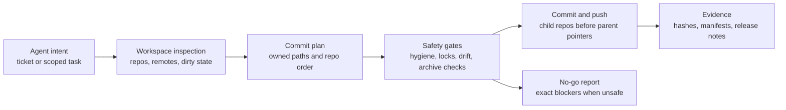

# Kano Git Master (KOG)

**Intent-scoped Git automation for AI coding agents in real multi-repository workspaces.**

KOG helps an agent move from "finish this task" to a reviewable Git outcome
without guessing which repository owns the change, which files are safe to
stage, whether subrepos need to move first, or what evidence belongs with the
commit. It is a native `kog` / `kano-git` CLI for inspecting workspace state,
building an explicit commit plan, running safety gates, committing, pushing, and
recording the result.

**Version**: 0.0.1 alpha

**Public status**: GitHub Release
[`v0.0.1`](https://github.com/kanohorizonia/kano-git-master-skill/releases/tag/v0.0.1)
is published as a prerelease with a validated source archive, manifest, and
checksum; see the
[v0.0.1 alpha release report](./docs/release/v0.0.1-alpha-release.md). Public
release assets are governed by the
[Public Artifact Contract](./docs/guides/public-artifact-contract.md). Native
binary, MSI, and package-manager channels are not claimed unless matching
release assets and checksums have been verified.



## What KOG Solves

- AI agents often work in workspaces that contain nested repositories,
  submodules, generated artifacts, and unrelated dirty files.
- Plain `git add . && git commit` is too broad for item-scoped agent work.
- Release claims need verifiable tags, manifests, checksums, and smoke evidence,
  not assumptions based on local files.

KOG gives the agent a narrow Git control plane: discover the repo graph, plan the
commit, validate safety gates, push in the correct order, and report exactly what
happened.

## What KOG Is Not

- Not a replacement for Git; it wraps Git with agent-oriented policy and
  evidence.
- Not an arbitrary shell runner; command execution stays inside the public KOG
  command surface.
- Not a package publisher by itself; package channels and binary downloads are
  only public when release artifacts prove they exist.

## Safety Model

- Inspect first: repo topology, remotes, branch state, dirty files, and locks.
- Plan before mutation: owned paths, exact repositories, and commit order are
  explicit.
- Keep commits scoped: unrelated dirty files stay out of the staged set.
- Push child repos before parent gitlinks or superproject pointers.
- Emit evidence: commit hashes, export manifests, checksums, and no-go blockers
  are first-class results.

## Quick Start

Use the `kog` entry point first. In a source checkout it is backed by the
tracked launcher before the native binary is built, and it prints the current
launcher-level command surface.

```bash
kog --help
kog status
kog overview
```

Build the native CLI when you need the full command surface:

```bash
kog self build
kog self rebuild
```

The normal developer build may fetch C++ dependencies from GitHub through CMake
FetchContent. That is expected for online developer and CI builds.

## Current Command Surface

Start here when updating docs, writing agent prompts, or validating a release:

- [Current Command Surface](./docs/guides/current-command-surface.md)
- [KCC Commit Message Policy](./docs/guides/kcc-commit-message-policy.md)
- [Public Artifact Contract](./docs/guides/public-artifact-contract.md)
- [CI/CD Trigger Policy](./docs/status/ci-cd-trigger-policy.md)
- [Documentation Index](./docs/README.md)
- [CPA Commit Plan Workflow](./docs/guides/cpa-commit-plan-workflow.md)
- [Repo Hygiene](./docs/repo-hygiene.md)

Common commands:

```bash
# Help / discovery
kog --help
kog status
kog overview
kog discover
kog fetch
kog log --remote-count 3

# Commit / plan flows
kog plan new
kog plan runbook commit
kog commit -m "chore: update workspace"
kog commit-push -m "chore: update workspace"
kog cpa

# Hygiene / export
kog repo-hygiene check
kog repo-hygiene fix
kog export --help
kog export --single
kog export --single --include-subrepos
kog export --subtree "/path/to/repo/Engine/Source/Programs/UnrealGameSync" --name UnrealGameSync --source head
kog export --subtree Engine/Source/Programs/UnrealGameSync --source working-tree
kog export upload doctor
kog export upload --last
kog export upload --last --target drive_sync --layout Kano/kog --copy-manifest --copy-sha256
```

Unknown top-level commands now print git-style guidance and suggest the most similar public command names.

Subtree standalone export notes:
- `--subtree` accepts absolute or relative paths.
- Default archive root strips parent path (`UnrealGameSync/...`).
- Use `--keep-subtree-path` to keep full repo-relative path in archive.
- `--subtree` cannot be combined with `--single` or `--include-submodule-stubs`.
- `--subtree` skips release archive smoke validation; `--validate-release-archive` is rejected.

Export upload notes:
- `kog export upload` uploads or copies an existing export archive after `kog export`.
- Configure targets in `~/.kano/kog_config.toml` and repo `.kano/kog_config.toml`; repo config overrides user config, and CLI flags override both.
- Supported live backends are `local-sync-folder` and `rclone`; `gdrive-api` is guidance-only in this release.
- For `local-sync-folder`, configure an existing sync root such as `/path/to/sync/root`; `layout` is a safe relative subfolder created below that root. The archive is copied always, while the original export manifest and `.sha256` sidecar require `copy_manifest = true` / `copy_sha256 = true` or matching CLI flags.
- For `rclone`, use an existing configured remote such as `remote = "kog-drive"` and `destination = "exports/kog"`; no Google OAuth backend is started or configured by KOG.
- Uploads preserve private/default backend visibility. Private Google Drive URLs are returned only when rclone exposes a Drive file ID; local sync never invents a cloud URL. Public links require explicit CLI confirmation with `--public-link --yes` because `rclone link` may mutate sharing permissions.

Example upload config:

```toml
[export.upload]
default_target = "drive_sync"

[export.upload.targets.drive_sync]
type = "local-sync-folder"
path = "/path/to/sync/root"
layout = "Kano/kog"
copy_manifest = true
copy_sha256 = true
return_url = false

[export.upload.targets.gdrive]
type = "rclone"
remote = "kog-drive"
destination = "exports/kog"
layout = "ChatGPT_Export"
copy_manifest = true
copy_sha256 = true
return_url = true
```

## Wrapper Entry Points

- `scripts/kog` and `scripts/kano-git` are the canonical Unix launchers.
- `scripts/kog.bat` and `scripts/kano-git.bat` are the Windows CMD/PowerShell
  launchers.
- Do not use separate root installer wrappers such as `scripts/kog-installer` and `scripts/kano-git-installer`; they are not part of the current command surface.
- Bash completion is installed through the native command surface:

```bash
kog completion install bash
```

## Build and Test

Preferred local validation before committing:

```bash
pixi run quick-test
pixi run test
```

Enable the tracked Git hook when working on this repository:

```bash
git config core.hooksPath .githooks
```

Preferred native build:

```bash
kog self build
kog self rebuild
```

Report and coverage lanes:

```bash
pixi run test-report
pixi run coverage-all
pixi run gather-reports
```

Linux CI/export lanes:

```bash
pixi run ci-linux-quick-test
pixi run ci-linux-test-report
pixi run ci-linux-coverage-all
pixi run ci-linux-export
```

Single-file release export automatically runs release archive validation when
validation support is present:

```bash
kog export --single
kog export --single --validate-release-archive

# pointer-only (default) vs expanded subrepo export
# pointer-only: root archive + subrepo pointers in manifest
kog export --single

# expanded: include subrepo working-tree files in root archive
kog export --single --include-subrepos

# expanded + tolerate missing subrepos (records failure in manifest)
kog export --single --include-subrepos --allow-missing-subrepos
```

To debug shared-library failures in `kano-jenkins-skill` (for example
`pipeline-libraries/unreal/vars/unrealBuild.groovy`), use expanded mode so
the tar contains real subrepo files for offline review.

Shared native build/test/report/bootstrap helpers live in
`src/cpp/shared/infra/scripts/`. Use them as infrastructure backing scripts, not
as the primary Git workflow UX.

## Canonical Test and Report Tasks

Root Pixi task facade:

- `pixi run build`: canonical repo-root native build wrapper; enters `src/cpp/shared/infra` before running the shared manifest build lane.
- `pixi run quick-test`: fast local deterministic confidence lane.
- `pixi run test`: default local deterministic validation lane.
- `pixi run full-test`: broad deterministic local validation lane.
- `pixi run test-report`: normalize and validate test report rendering inputs.
- `pixi run coverage-report`: render-only coverage report stage.
- `pixi run coverage-all`: canonical coverage lane (`build -> gather -> report`).
- `pixi run gather-reports`: gather raw evidence and delegate final rendering.
- `pixi run pgo-gather`: canonical PGO training lane.
- `pixi run pgo-rebuild`: canonical release PGO lane (`pgi-build -> pgo-gather -> pgo-build`).
- `pixi run pgo-gather-with-coverage`: optional unified training-observation lane for supported backends.
- `pixi run profile-run-manifest`: emit the coverage/PGO capability manifest for the selected lane.
- `pixi run ci-linux-build`: Linux release build on a native Linux node or any Docker-capable host.
- `pixi run ci-linux-quick-test`: Linux quick-test lane on a native Linux node or any Docker-capable host.
- `pixi run ci-linux-test-report`: Linux report-collection lane that writes canonical raw test evidence.
- `pixi run ci-linux-coverage-all`: Linux coverage gather lane that writes canonical raw coverage evidence.
- `pixi run ci-linux-export`: Linux export lane that runs the native Linux binary for `kog export`.

Wrapper note:

- Repo-root Pixi wrappers `cd src/cpp/shared/infra && pixi run <task>` on purpose.
- Build-style tasks that invoke CMake presets must run with `src/cpp/` as the effective project root; direct `--manifest-path` forwarding can incorrectly make CMake search for `src/cpp/shared/infra/CMakePresets.json`.

Report rendering ownership:

- Raw evidence (JUnit/CTest/Cobertura/logs) is produced by this repo.
- Final human and machine summaries are rendered by `kano-cpp-test-skill`.
- Canonical outputs are feature-first summaries:
  - `test-summary.json`
  - `test-summary.md`
  - `html/index.html`
  - `suites/<suite-id>/summary.json`
- Internal temporary paths such as `.tmp-test-result` are raw artifact paths only
  and must not appear as public suite titles.

Legacy note:

- Local scripts that directly render per-run JUnit HTML are legacy compatibility
  helpers and are not the canonical CI report renderer.
- Jenkins jobs that must emit canonical test + coverage reports should run
  `test-report -> coverage-all -> gather-reports`; `coverage-all` does not
  replace the separate test-report lane.
- CI jobs that need actual coverage evidence should prefer `coverage-all`; `coverage-report`
  alone is only the render stage and does not perform the build/gather work.
- Release/profile optimization jobs should use `pgo-rebuild`; that is a separate
  `pgi-build -> pgo-gather -> pgo-build` flow and is not the default CI report lane.

## Documentation Status

The native C++ CLI is now the source of truth for current workflows. Some older
architecture notes and historical examples may still mention retired root shell
scripts. Treat those as legacy notes unless they are referenced from
[Current Command Surface](./docs/guides/current-command-surface.md).

For C++ coverage/PGO provider semantics and guardrails, see
[C++ coverage and PGO provider model](./docs/cpp-profile-coverage-pgo-model.md).

## License

MIT License. See [LICENSE](./LICENSE).
