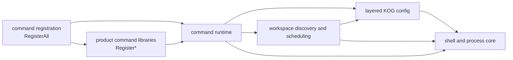

# Command Library Dependency Graph

The native command libraries use a one-way composition graph. Dependencies point
from higher-level composition toward lower-level services:

## Ownership Boundaries

| Layer | Owns | May depend on |
|---|---|---|
| `kano_git_config` | Layered config paths, reads, writes, and model/config normalization | shell |
| `kano_git_workspace` | Repository discovery, health, manifests, and operation scheduling | config, shell |
| `kano_git_command_runtime` | Shared command execution, AI runtime helpers, and runtime operations | workspace, config, shell, CLI11 |
| `kano_git_cmd_*` | Product-specific command implementations and `Register*` entry points | runtime, workspace, shell, product-specific third parties |
| `kano_git_command_registration` | `RegisterAll`, declaration composition, and the optional commands module | runtime and every product command library |
| `kano_git_command` | Consumer-facing aggregate target | registration only |

The config API keeps its existing `kano::git::commands::kog_config` namespace so
the dependency refactor does not alter behavior or call sites.

## Enforced Rules

- Core workspace code must not depend on command runtime.
- Command runtime must not own `RegisterAll` or depend on product command libraries.
- Product command libraries may depend downward on runtime, never on registration.
- Registration is the only layer that composes all `Register*` functions.
- The aggregate target must not use linker rescan groups such as `--start-group`.

The CLI architecture test checks these CMake and source ownership boundaries.
The generated CMake Graphviz target graph and native CLI/TUI link commands provide
build-time evidence that the graph remains acyclic.
