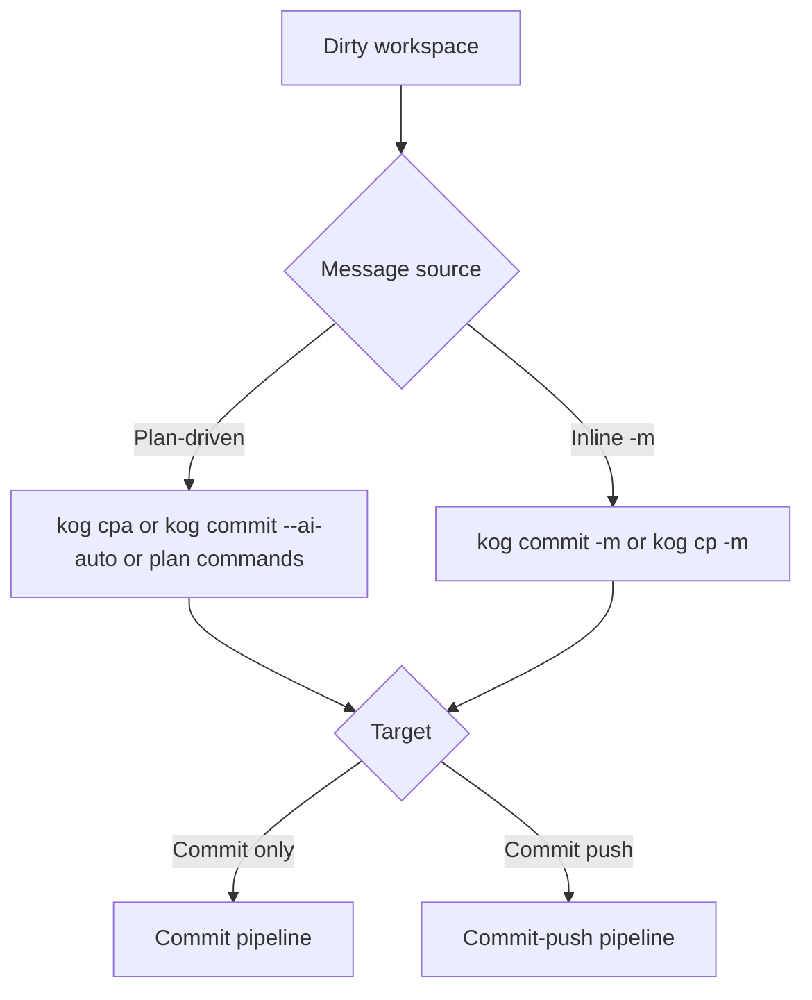
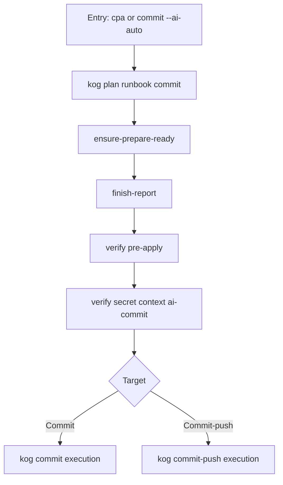
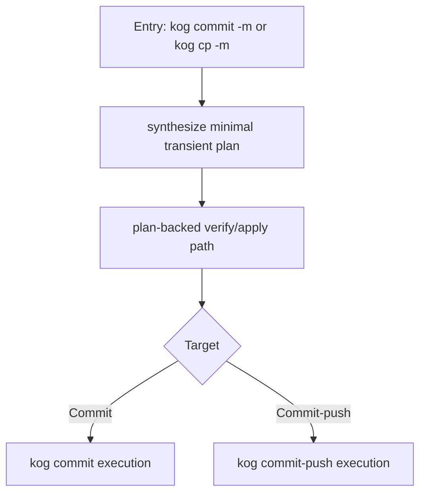

# KOG Commit and Push Workflow

This guide describes how `kog` commit and commit-push flows work today, including:
- full-auto
- semi-auto
- manual
- plan-driven vs `-m` message-driven

AI is only used when generating/filling plan content.  
All verify/apply/execute gates are deterministic non-AI stages.

## Quickstart by Scenario

| Scenario | Use this | Commands |
|---|---|---|
| Full auto commit-push (human mode) | One command | `./kog cpa` or `./kog commit-push --ai-auto` |
| Full auto commit-push (agent mode) | One command | `KANO_AGENT_MODE=1 ./kog cpa` |
| Full auto commit-only | One command | `./kog commit --ai-auto` |
| Semi-auto (AI generates plan, human reviews, then execute) | Prepare -> review -> execute | `./kog pia --force` -> review `.kano/tmp/git/plans/default-plan.json` -> `./kog pv` -> `./kog cpa` |
| Manual plan-driven commit-only | Human fills plan | `./kog pi --force` -> edit plan -> `./kog pv` -> `./kog commit --plan-file .kano/tmp/git/plans/default-plan.json --plan-stage commit` |
| Manual plan-driven commit-push | Human fills plan | `./kog pi --force` -> edit plan -> `./kog pv` -> `./kog cp --plan-file .kano/tmp/git/plans/default-plan.json` |
| Non-AI inline commit-only | Manual message shorthand for a minimal synthesized plan | `./kog commit -m "your message"` |
| Non-AI inline commit-push | Manual message | `./kog cp -m "your message"` or `./kog commit-push -m "your message"` |

Notes:
- `cpa` can auto-shortcut to `cp -m` when scope is `1 dirty repo + 1 change`.
- Use `KOG_CPA_DISABLE_SINGLE_CHANGE_SHORTCUT=1` to disable that shortcut.

## Aliases

- `cp` -> `commit-push`
- `cpa` -> human mode: `commit-push --ai-auto`
- `KANO_AGENT_MODE=1 cpa` -> agent-mode shared-plan path (deterministic plan bootstrap/refresh + `commit-push --plan-file ...`)
- `pi` -> `plan new`
- `pia` -> `plan new --ai-auto`
- `pv` -> `plan verify pre-apply`

## Agent-Mode Ownership Contract

In `KANO_AGENT_MODE=1`:

- external agent owns semantic authoring decisions
- `kog` owns deterministic plan bootstrap, freshness refresh, verification, execution, sync, and push
- agent mode must not fall back to internal provider-driven `--ai-auto` planning

Operationally this means:

- human `cpa` may invoke internal AI plan preparation
- agent-mode `cpa` must use the shared plan file path
- deterministic metadata such as `plan_id` and planner identity should be produced by tooling, not hand-patched by the agent

Provider-owned exact-file lanes may set `KOG_PLAN_FRESHNESS_SCOPE=repo` for
the complete `plan new` through `commit-push` child-process sequence. This
keeps base-head and dirty fingerprints scoped to the current repository, uses
distinct `repo-head-v1` and `repo-dirty-v1` hashes, and avoids nested workspace
discovery for a single-repo plan. The variable is an internal orchestration
contract: do not expose it as caller input, and do not mix scopes between plan
creation and apply. A scope mismatch produces different hashes and must fail
closed as workspace drift.

For an explicit scoped `--plan-file`, `commit-push` detects pending work from
the plan include paths instead of recursively scanning the workspace before
dispatch. An exact-path status failure is not clean: the pipeline fails closed
before commit. This keeps unrelated registered child repositories out of the
critical path while preserving exact include/exclude staging and secret gates.
The commit stage refreshes declared include pathspecs without resetting the
whole index and skips whole-tree gitlink discovery when the plan owns no nested
repository. This keeps exact-file archive commits bounded in repositories with
large worktrees. If a bounded whole-repo preflight cannot enumerate that
worktree, the staged-only commit path uses the cached diff as its authoritative
change signal instead of treating the staged plan as clean. Git path-list reads
disable quoted path escaping so Unicode include paths retain the same identity
through safety checks, staging, and commit.

## Copilot Chat Session Note

- Observed behavior: human-mode `cpa` may create a new Copilot Chat session on each run.
- Current workflow should assume chat-session continuity is unreliable.
- Prompt files, shared plan files, and canonical workspace state are the reliable continuity mechanisms.

## Plan Lifecycle

Current lifecycle model:

`new -> init -> prepare -> verify(pre-apply) -> apply -> verify(post-apply) -> finish`

Mapped commands:

- `new`
  - `kog plan new`
- `init` (stage-specific bootstrap)
  - `kog plan ignore-init`
- `prepare`
  - `kog plan ensure-prepare-ready`
  - `kog plan runbook commit` (aggregated prepare flow for commit stage)
  - `kog plan runbook ignore` (aggregated init + verify for ignore stage)
  - `kog plan runbook full` (aggregated ignore + commit prepare and verify)
- `verify pre-apply`
  - `kog plan verify pre-apply`
  - `kog plan verify ignore`
  - `kog plan verify secret`
- `apply`
  - `kog plan apply --stage ignore`
  - `kog plan apply --stage commit`
- `verify post-apply`
  - `kog plan verify post-apply`
- `finish`
  - `kog plan finish-report`

Auxiliary:
- `kog plan prepare-scope` (counts dirty repos and changed entries; used by `cpa` shortcut routing)
- `kog plan refresh-check` (plan freshness guard)

## What `ensure-prepare-ready` Does

`kog plan ensure-prepare-ready` is the prepare-stage orchestrator for commit plan readiness.

It performs:
1. Ensure a plan file exists (or fail with hint to create one).
2. Initialize/refresh commit stage scaffold when needed.
3. Fill missing commit-plan content through selected AI provider when required.
4. Validate required commit-plan fields and completeness.
5. Fail fast if still incomplete; pass only when executable.

It is still a prepare-stage action.  
No commit/push execution happens here.

## What Post-Apply Verifies

`kog plan verify post-apply` checks the result state after apply/execution, for example:
- plan execution markers updated correctly
- stage completion status consistent
- expected stage outputs exist

`kog plan apply` already auto-triggers post-apply verify for corresponding stages.

## Flow Overview

Execution ordering semantics:
- `sync` is `parent-first convergence`
- `commit-push` is `child-first convergence`

Rationale:
- `sync` updates parent repos first so refreshed `.gitmodules` branch policy can be applied to registered children in the same run.
- `commit-push` commits and pushes child repos first, then lets parent repos absorb the final gitlink pointer and push parent repos last.
- first-run correctness is the target; "run it a second time" is not an acceptable steady-state convergence model.

### Entry Routing

### Plan-Driven AI Path

### Non-AI Inline Message Path

Notes:
- `kog commit -m "..."` is no longer a direct non-plan bypass; it now synthesizes a
  minimal transient plan and then reuses the same plan-backed execution path as
  `--plan-file`.
- `--plan-file` and `-m/--message` are mutually exclusive.

## Stage Command Matrix

| Stage | Commands |
|---|---|
| New | `kog plan new` |
| Init (stage seed) | `kog plan ignore-init` |
| Prepare | `kog plan ensure-prepare-ready`, `kog plan runbook commit`, `kog plan runbook ignore`, `kog plan runbook full` |
| Verify pre-apply | `kog plan verify pre-apply`, `kog plan verify ignore`, `kog plan verify secret` |
| Apply | `kog plan apply --stage ignore`, `kog plan apply --stage commit` |
| Verify post-apply | `kog plan verify post-apply` |
| Finish | `kog plan finish-report` |

## Gate and Override Flags

- Ignore gate override: `--allow-ignore-gate`
- Secret gate override: `KOG_DISABLE_SECRET_GATE=1`
- AI provider/model pin:
  - `--ai-provider [provider]`
  - `--ai-model [model]`
- Disable plan auto behavior:
  - `--no-plan-auto`

## Ignore Datasource

Ignore planning can reference datasource content from:
- skill-local rules
- upstream templates (for example `github/gitignore`)

Manifest paths should be explicit and operator-readable (relative or absolute path), not ambiguous folder labels.

## See Also

- [Ignore Plan Operator Workflow](./ignore-plan-operator-workflow.md)
- [Quick Start](./quick-start.md)
