# Test Case Diagrams

Visual diagrams explaining test cases and script behaviors using Mermaid.

## Table of Contents

- [Test Suite Overview](#test-suite-overview)
- [Script Workflows](#script-workflows)
- [Test Scenarios](#test-scenarios)
- [Tools for Viewing](#tools-for-viewing)

## Test Suite Overview

### Test Execution Flow

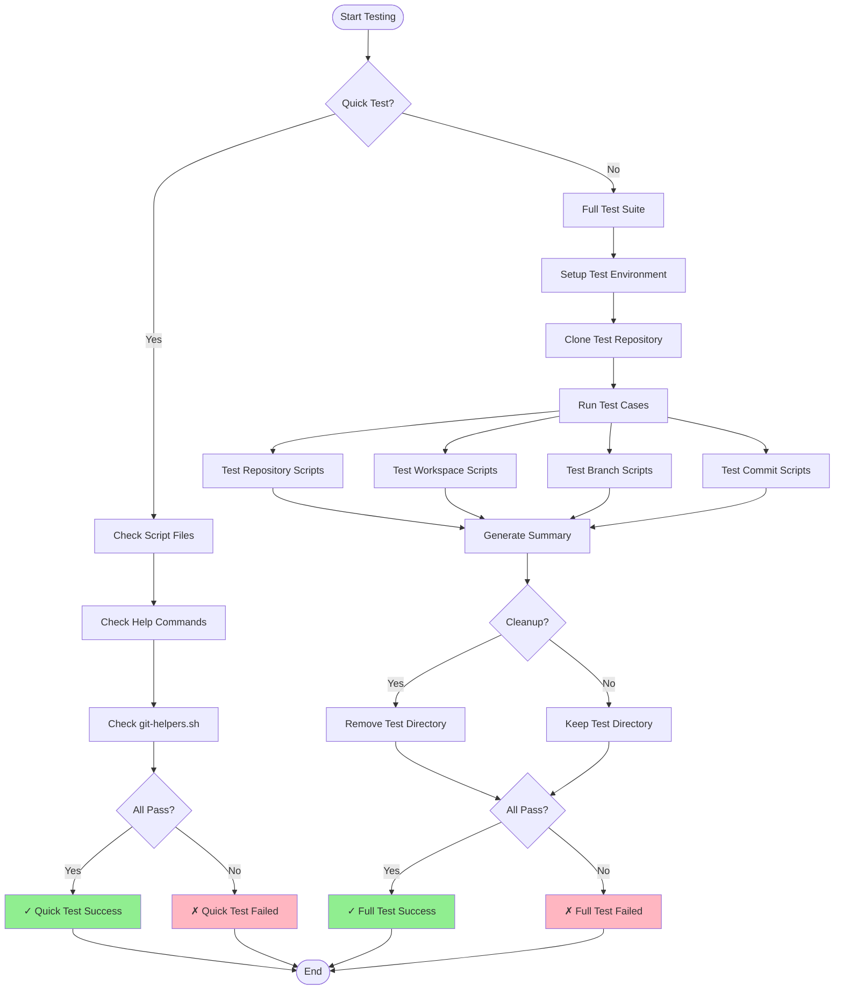

### Test Coverage Map

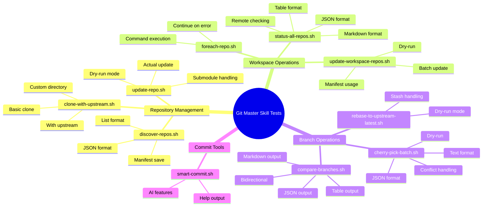

## Script Workflows

### 1. update-repo.sh Workflow

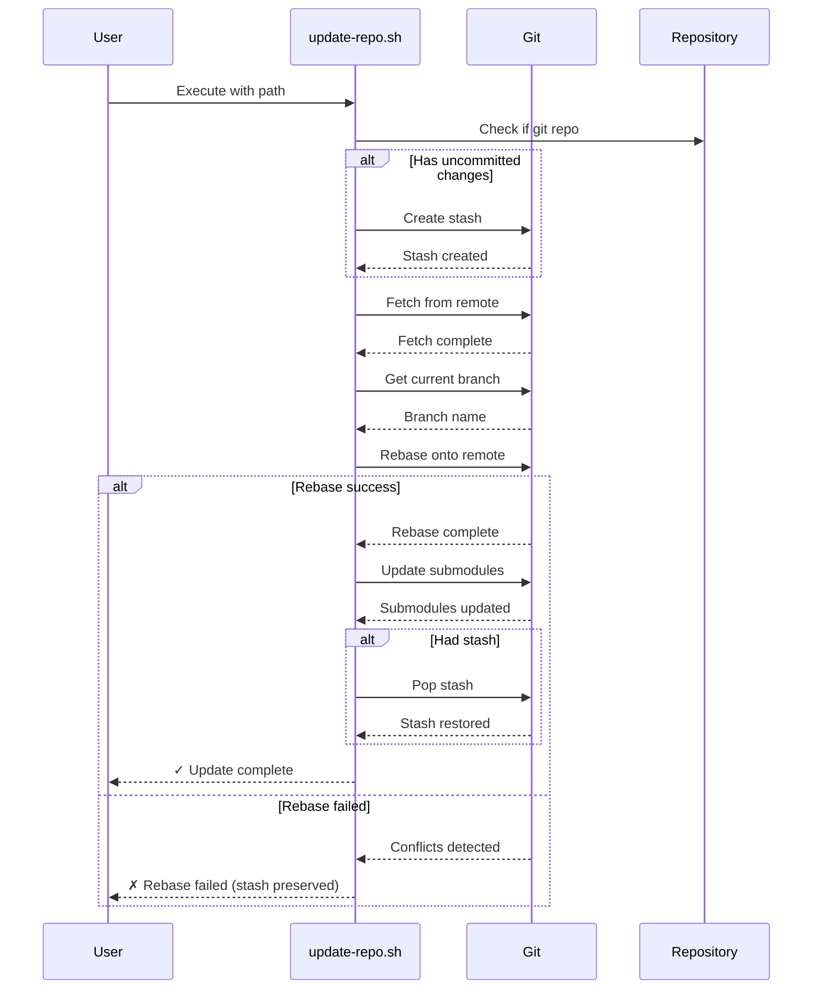

### 2. compare-branches.sh Workflow

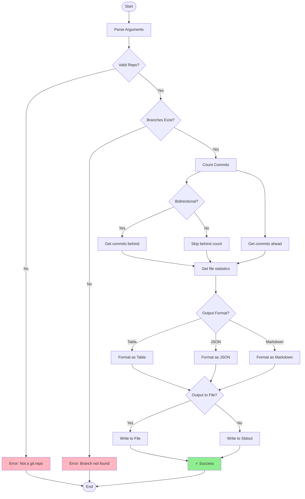

### 3. cherry-pick-batch.sh Workflow

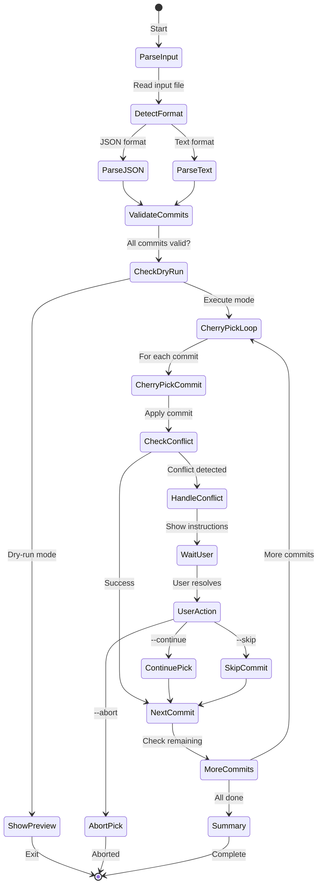

### 4. discover-repos.sh Workflow

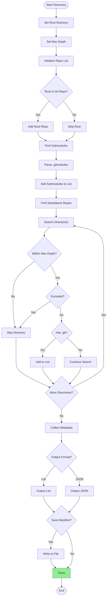

## Test Scenarios

### Test Scenario 1: Update Repository with Stash

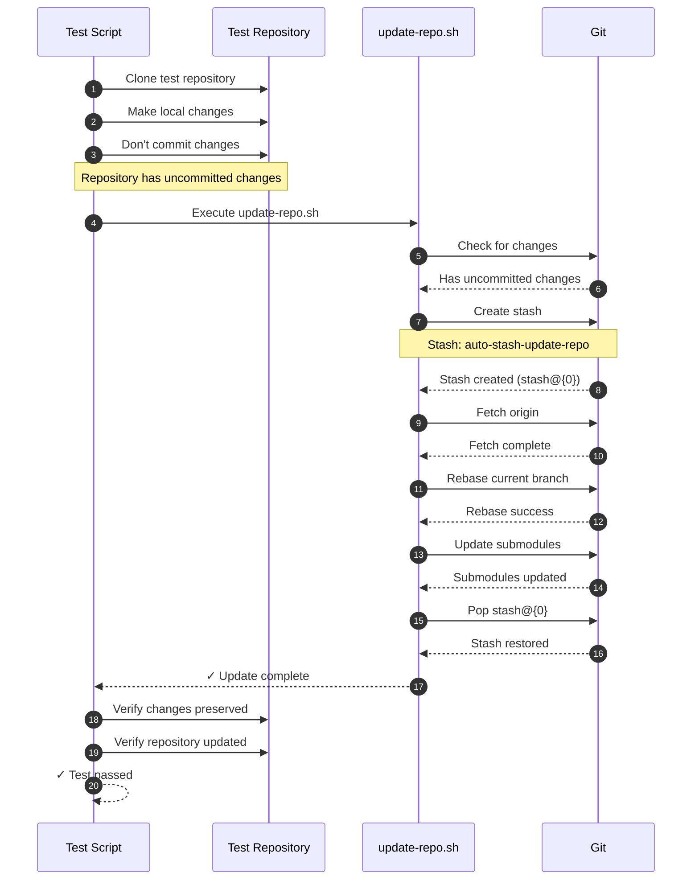

### Test Scenario 2: Compare Branches

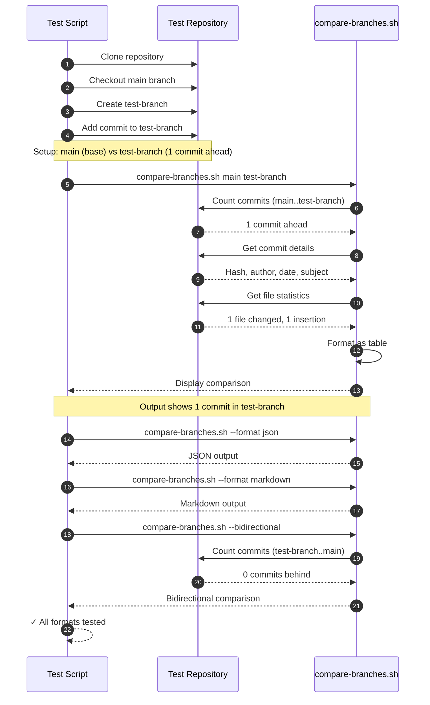

### Test Scenario 3: Cherry-Pick Batch

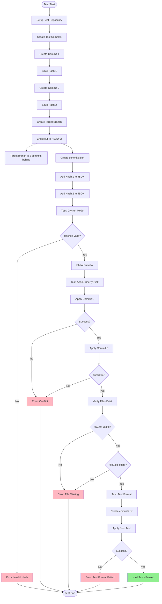

### Test Scenario 4: Workspace Discovery and Update

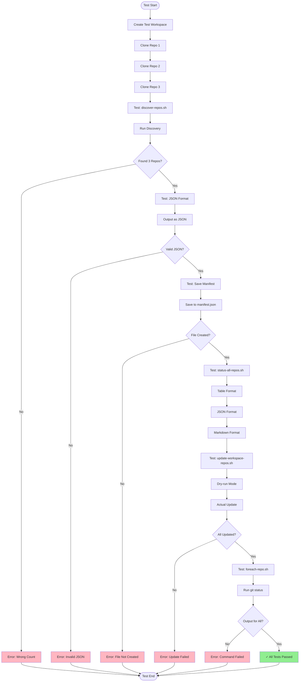

## State Diagrams

### Repository State During Update

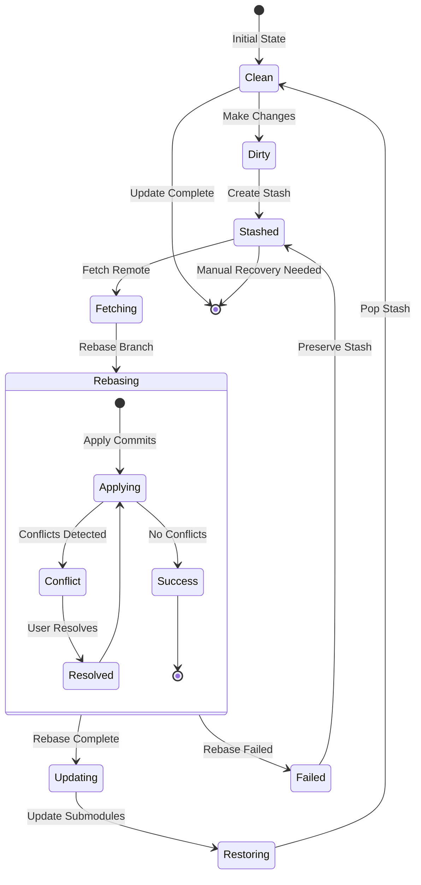

### Test Execution States

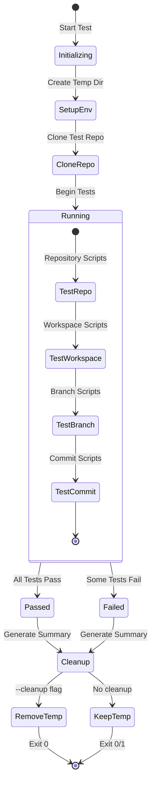

## Tools for Viewing Diagrams

### Online Tools

1. **Mermaid Live Editor** (Recommended)
   - URL: https://mermaid.live/
   - Features: Real-time preview, export to PNG/SVG
   - Usage: Copy diagram code and paste

2. **GitHub/GitLab**
   - Both support Mermaid in markdown files
   - Renders automatically in README.md

3. **VS Code Extensions**
   - **Markdown Preview Mermaid Support**
   - **Mermaid Markdown Syntax Highlighting**
   - Install and preview in VS Code

### Command Line Tools

1. **Mermaid CLI**
   ```bash
   # Install
   npm install -g @mermaid-js/mermaid-cli
   
   # Generate PNG
   mmdc -i diagram.mmd -o diagram.png
   
   # Generate SVG
   mmdc -i diagram.mmd -o diagram.svg
   ```

2. **Markdown to HTML**
   ```bash
   # Install
   npm install -g markdown-it markdown-it-mermaid
   
   # Convert
   markdown-it TEST-DIAGRAMS.md > output.html
   ```

### Desktop Applications

1. **Typora** (Paid)
   - Native Mermaid support
   - WYSIWYG markdown editor
   - Export to PDF/HTML

2. **Obsidian** (Free)
   - Mermaid plugin available
   - Knowledge base tool
   - Local-first

3. **Draw.io / diagrams.net** (Free)
   - Can import Mermaid
   - Export to many formats
   - Online and desktop versions

### IDE Integration

1. **VS Code**
   ```bash
   # Install extensions
   code --install-extension bierner.markdown-mermaid
   code --install-extension bpruitt-goddard.mermaid-markdown-syntax-highlighting
   ```

2. **IntelliJ IDEA / WebStorm**
   - Built-in Mermaid support in markdown preview
   - No plugin needed

3. **Vim/Neovim**
   - Use `markdown-preview.nvim` plugin
   - Supports Mermaid rendering

## Exporting Diagrams

### To PNG/SVG

```bash
# Using mermaid-cli
mmdc -i TEST-DIAGRAMS.md -o diagrams/

# Using puppeteer
node export-diagrams.js
```

### To PDF

```bash
# Using pandoc
pandoc TEST-DIAGRAMS.md -o TEST-DIAGRAMS.pdf

# Using markdown-pdf
markdown-pdf TEST-DIAGRAMS.md
```

### To HTML

```bash
# Using markdown-it
markdown-it TEST-DIAGRAMS.md > TEST-DIAGRAMS.html

# Using pandoc
pandoc TEST-DIAGRAMS.md -s -o TEST-DIAGRAMS.html
```

## Usage Examples

### View in Browser

```bash
# Open in Mermaid Live Editor
# 1. Copy diagram code
# 2. Go to https://mermaid.live/
# 3. Paste and view

# Or use local HTML
markdown-it TEST-DIAGRAMS.md > output.html
open output.html  # macOS
start output.html # Windows
xdg-open output.html # Linux
```

### Generate Images

```bash
# Install mermaid-cli
npm install -g @mermaid-js/mermaid-cli

# Extract and convert each diagram
# (Manual process or use script)
mmdc -i diagram1.mmd -o diagram1.png
mmdc -i diagram2.mmd -o diagram2.svg
```

### Embed in Documentation

```markdown
# In your markdown file

## Test Flow

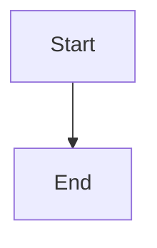

This will render automatically on GitHub/GitLab.
```

## Tips

1. **Use Mermaid Live Editor** for quick viewing and editing
2. **GitHub/GitLab** automatically render Mermaid in markdown
3. **VS Code** with extensions provides best local experience
4. **Export to PNG/SVG** for presentations or documentation
5. **Keep diagrams simple** - complex diagrams are hard to read

## References

- [Mermaid Documentation](https://mermaid.js.org/)
- [Mermaid Live Editor](https://mermaid.live/)
- [GitHub Mermaid Support](https://github.blog/2022-02-14-include-diagrams-markdown-files-mermaid/)
- [Mermaid CLI](https://github.com/mermaid-js/mermaid-cli)
